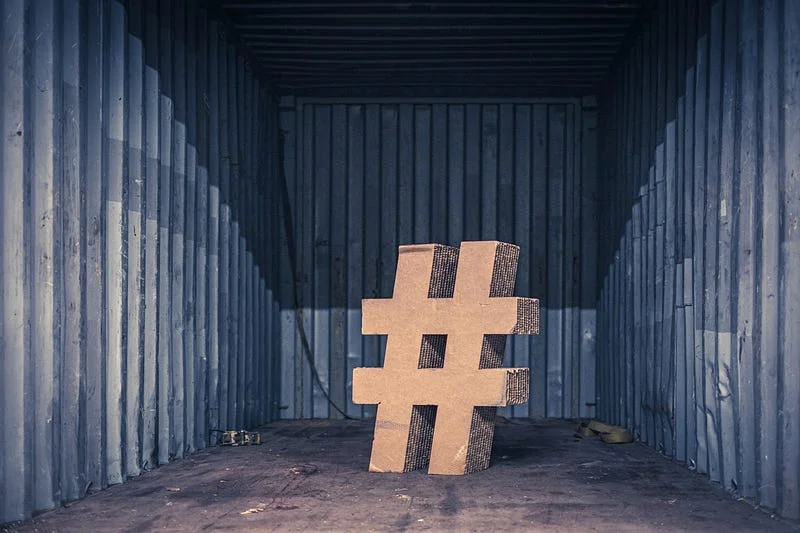
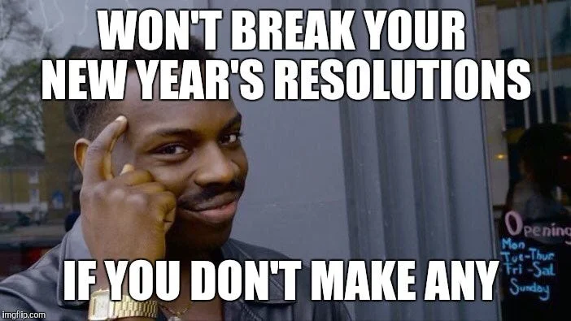

Recently in my country, many hashtag challenges are going viral. Challenges like #couplechallenge, #singlechallenge, #dropyourdopephoto, #dropyourpout etc are coming and going around in social media platform. Is it a good thing? Is it a showoff? I can’t tell you that because I don’t know the reason behind that. LOL

#### Progressive Challenges

I have seen both sides these challenges. Challenges were made jokes, commitments and many more. One day, I came across #30dayschallenge. I thought one couldn’t do anything in 30days but I decided to touch that hashtag and see all the content using to that hashtag. I was amazed to see that so many people were participating in that challenge. #30dayschallenge captured people from all the niches. It was people challenging themselves from running a mile a day to sleeping 8 hrs a day. The general format of the challenge went like this

> #day1 of #30dayschallenge #niche/topic

#### New Year’s Resolution

A year passes and I am sitting pissed off, angry with myself that I couldn’t achieve a thing out of a list of things that I promised myself a year ago. Like most of the people. I could never stick to a plan for more than a couple of week. Again, I lied promised that this time I will do it. **_Ah shit here we go again_** A year passes and the same cycle continues. The same problem lies in all of us. If you could stick to a commitment for all over a year, this article is definitely not for you.

> Only 8% complete their new year’s resolution

#### Why #30dayschallenge

Some of my relatives some how managed to sacrifice meat products for a month even being meat hungry in nature. That is too good of a motivation. Islams fast for around a month. If they can do that, I am sure you can do that too. Every single Islamic people is a motivation for all of us.

> Most of us, the average people, take around 21 days to build a habit.

I am a coder and I have been coding for around 4 years. But learning new language was always a problem for me. I managed to solve this problem by committing to a 30 days challenge. Its **#day-19** today and I feel comfortable with the new language. I am learning Node. I feel comfortable with node in day-17 of the challenge. I tried to learn node 3 times before but I never went that far. This has been the personal impact of #30dayschallenge in my life.

#### What should I challenge myself on?

You can challenge yourself on many things. Find a topic that you are lacking behind on. You can focus on your body, relationship or sleep cycle. You can challenge yourself to run a mile each day. You don’t need to be perfect in between or at the end of the challenge. You just need to do it.

> Better to approach a problem like many pieces to be solved everyday rather than procrastinating everyday

#### Conclusion

It is better to do something rather than doing nothing. The challenge is to bring you out of your comfort zone. Take it as a opportunity to do more. Feel proud afterwards and post it in social media. Lets hope next time, I will find you when I browse through **#30dayschallenge** in my social medias.
