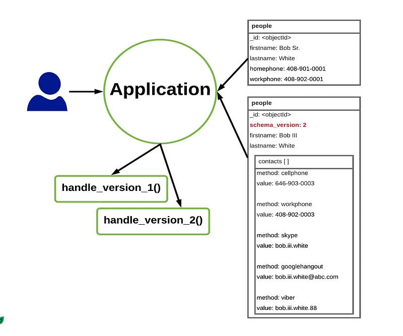
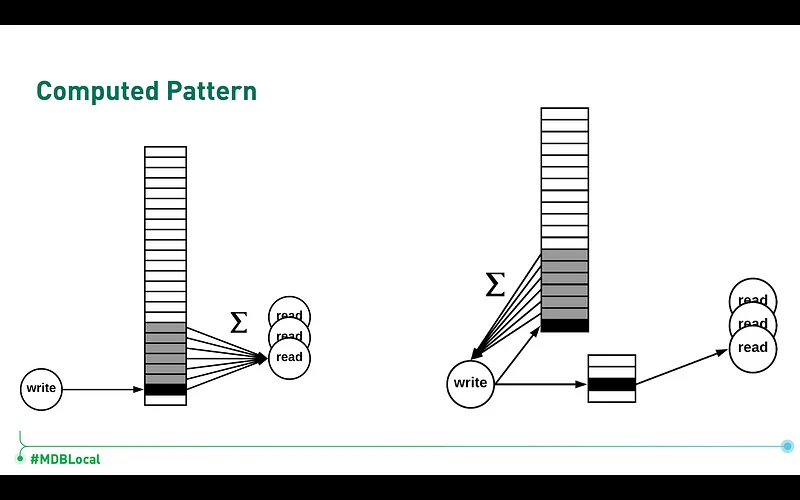
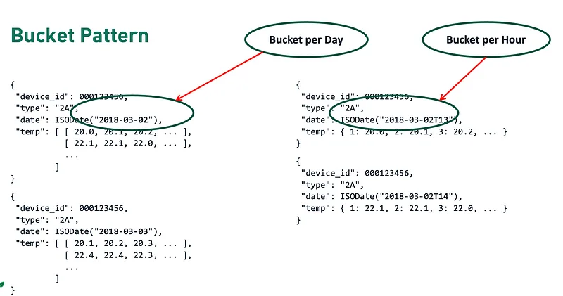
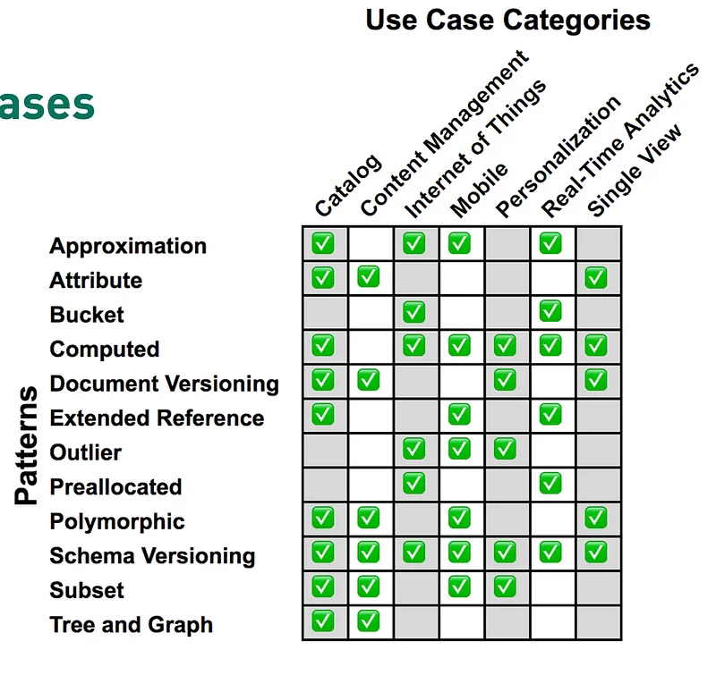

Here are some of the few design patterns that you can use to better your MongoDB schema, so you’ll keep your team happy and yourself happier.


MongoDB is a flexible schema based document database. Flexibility was something that we were craving after many years with SQL. Flexibility is so fun to code and enjoy until your application code is suffering from “What was the schema again?” problem. MongoDB follows document based design principle for modelling things. You can insert as many objects/arrays in MongoDB as long as you don’t hit the limit of 16mb. 
So, _chances of you never discovering the problem until it is very late is high._

Here are some of the design patterns you can model your schema with

## Schema versioning Pattern

In MongoDB schema, or any NoSQL based DB, schema versioning is a method in which we add a field representing the version of schema that the document obeys. Schema will be read by the application code, and a logic must be in place for handling every possible schema version value.



Schema version has its own pros and cons.

Pros:

*   Easier to handle changes
*   The flexibility of your application grows.
*   Easier to debug and track

Cons:

*   Added complexity in the application layer.
*   The database can grow inconsistent over time.
*   Database may be harder to navigate without application logic making it logically coupled with each other.

## Computed Pattern

Have you ever wondered, how can YouTube get the real time total views of a video?


The video above has 1.3B views, but if you were to count that in any DB using
```js
db.getCollection("video-views").find({}).count();
```
The query above would take ages to count the total views of the video. But on YouTube you can see the total view in an instant right. So let me introduce you to the computed value pattern. Instead of counting the video views every time, you introduce a field in video, say view which will get updated every time when a user views the video and now instead of counting the total views, you can present users with that value.



The new documents would be something like this, and your application service should increment the value of views every time someone views the video.
```json
{
  "title": "Rick Astley - Never Gonna Give You Up (Official Music Video)",
  "description": "1987 pop hit, famously used in internet 'Rickrolling' meme",
  "videoId": "dQw4w9WgXcQ",
  "views": 217383786
}
```
Pros:

*   Real time data is fetched every time
*   This is effective as the computed pattern only does a fraction of work for same result

Cons:

*   It may be harder to maintain, if you are computing the values in very short intervals.
*   The data may be incorrect if transactions are not in place

## Subset Pattern

Subset pattern in MongoDB is a pattern in we store a subset of field of a document in a foreign collection. It can be thought of as materialized view for MongoDB. For a big document, say user as
```js
{
  "_id": ObjectId("6155e5b5c3e30c0410c07e84"),
  "username": "johndoe",
  "email": "john.doe@example.com",
  "password": "$2a$12$R1..K94OiVJ.gNwINZfNkuNpJcoCJErjy.NxJmpg9cGJbEjK2rJ4S",
  "profile": {
    "firstName": "John",
    "lastName": "Doe",
    "birthdate": ISODate("1980-01-01T00:00:00Z"),
    "gender": "male",
    "address": {
      "street": "123 Main St",
      "city": "Anytown",
      "state": "CA",
      "zip": "12345"
    },
    "phoneNumbers": {
      "home": "555-1234",
      "work": "555-5678",
      "mobile": "555-9012"
    },
    "education": [
      {
        "degree": "Bachelor of Science",
        "major": "Computer Science",
        "university": "University of California, Los Angeles",
        "graduationYear": 2002
      },
      {
        "degree": "Master of Business Administration",
        "major": "Finance",
        "university": "Stanford University",
        "graduationYear": 2006
      }
    ],
    "workHistory": [
      {
        "company": "Acme Corporation",
        "position": "Software Engineer",
        "startDate": ISODate("2002-01-01T00:00:00Z"),
        "endDate": ISODate("2005-12-31T00:00:00Z")
      },
      {
        "company": "Widgets, Inc.",
        "position": "Product Manager",
        "startDate": ISODate("2006-01-01T00:00:00Z"),
        "endDate": ISODate("2010-12-31T00:00:00Z")
      },
      {
        "company": "XYZ Corp.",
        "position": "Director of Marketing",
        "startDate": ISODate("2011-01-01T00:00:00Z"),
        "endDate": null
      }
    ],
    "interests": [
      "hiking",
      "reading",
      "traveling",
      "playing guitar"
    ]
  },
  "preferences": {
    "language": "en",
    "theme": "light",
    "timezone": "AmericagLos\_Angeles"
  },
  "notifications": [
    {
      "type": "email",
      "frequency": "daily"
    },
    {
      "type": "sms",
      "frequency": "weekly"
    }
  ],
  "createdAt": ISODate("2021-09-30T10:15:01Z"),
  "updatedAt": ISODate("2022-10-01T14:30:05Z")
}
```

We can store a smaller, collection, say username, which holds a subset of fields from the user document which may look like this.
```js
{
  "_id": ObjectId("605edb98fbf3d639d3cf6c8f"),
  "name": "Jane Doe",
  "email": "jane.doe@example.com"
}
```
Note: We can achieve the same result using projection operation in MongoDB or $project pipeline in MongoDB aggregation. Now instead of using the user collection for reading the value, we can use username collection.

Pros:

*   Effective memory management
*   Shorter disk access time

Cons:

*   In case of transaction not being used, the collections may become inconsistent
*   Additional trips to the DB in case of create, update or delete operations

## Bucket Pattern

> In computer science, a bucket refers to a logical collection that holds similar items together.

For a log based application that has write heavy usage, _the application receives high amount of write operations as compared to read operations._ This type of access pattern can be found in a log application like user tracking system, gaming system, etc. The question of how would you divide the given written data is answered by the bucket pattern.

Let’s say that you are tracking temperature of a room using some devices and storing it in a database. Then a bucket based division can divide the written data records as



We can run analytics based on the bucket data, we can also add bucket pattern with computed data pattern to accommodate statistical data for our simplicity, the newer version of documents would look as

```javascript
{
  device_id: "device1",
  type: "2A",
  date: ISODate("2022-04-01T00:00:00Z"),
  temp: [20.5, 21.3, 22.1, 20.8, 21.7],
  mean_temperature: 21.28,
  std\_temperature: 0.72
},
{
  device_id: "device1",
  type: "2A",
  date: ISODate("2022-04-01T01:00:00Z"),
  temp: [21.1, 20.9, 21.5, 22.3, 20.4],
  mean_temperature: 21.24,
  std_temperature: 0.69
}
```
Pros:

1.  Good for IOT implementations
2.  Improves querying speed with indexes
3.  Great for time series data

Cons:

1.  Increased storage requirements
2.  Increased complexity
3.  Proper bucket selection must be done to prevent empty buckets

There are few more design pattern in MongoDB like the outlier pattern, Polymorphic pattern for your use cases. Each one of them have their pros and cons. [Here is a link to learn more about them.](https://www.mongodb.com/blog/post/building-with-patterns-a-summary) Here are some of the use cases of MongoDB design patterns



[You can follow me on LinkedIn, as I like to rant about technologies over there.](https://www.linkedin.com/in/nirjalpaudel/)

[https://www.linkedin.com/in/nirjalpaudel/](https://www.linkedin.com/in/nirjalpaudel/)

MongoDB pattern has its pros and cons and at the end of the day, proper usage of patterns is preventing you a call at 2am in the morning saying that DB is down but on the other hand you will miss the over time pay from your company, so choose wisely extra 💰 or 🛌.
