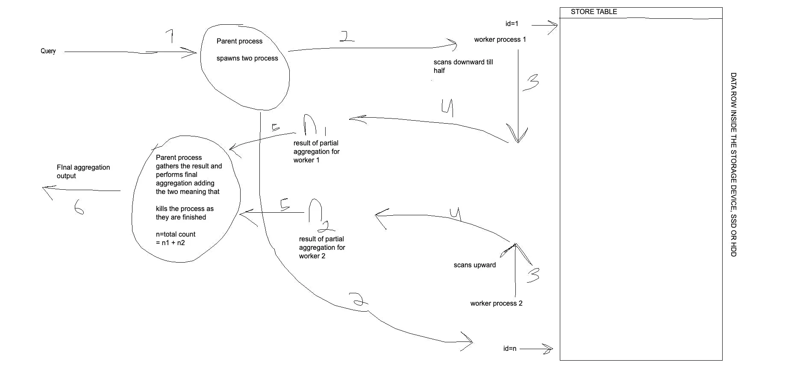
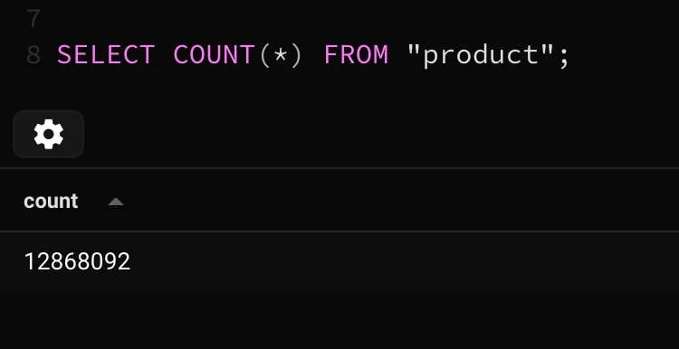
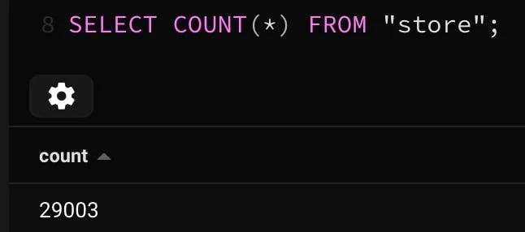
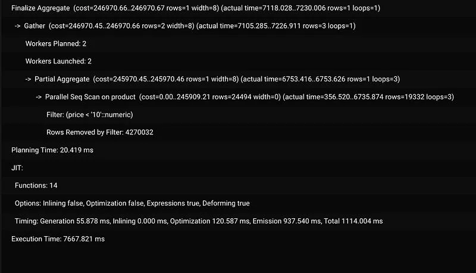
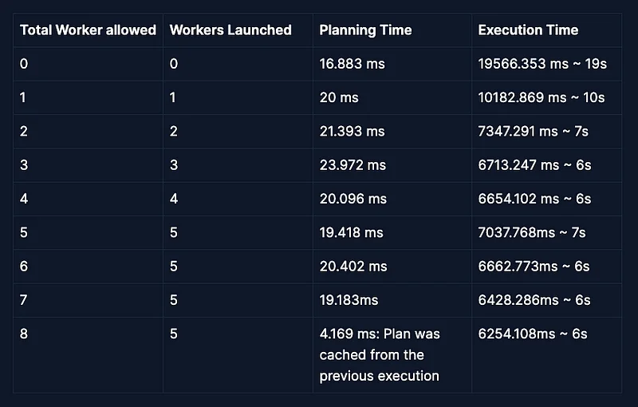
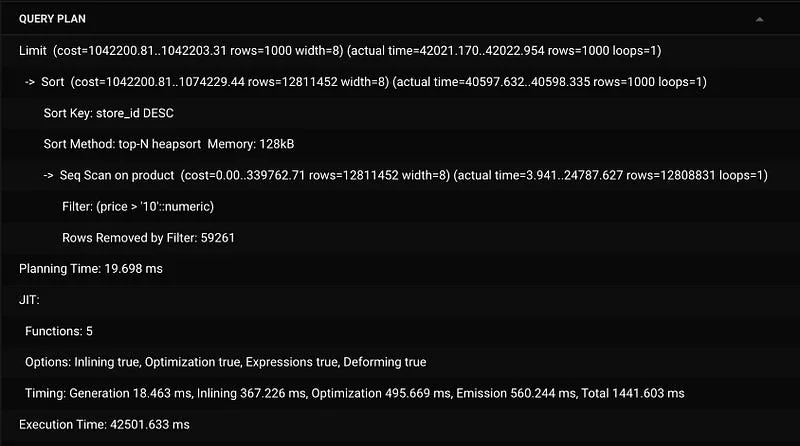
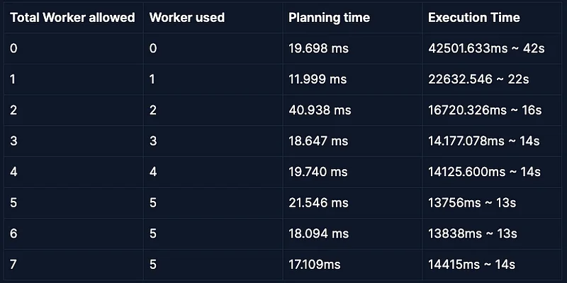

Both Just In Time compiler or JIT and worker processes could be news to you. By the end of this article, you would be able to understand the picture I have provided.



For this article, I have created a couple of Postgres tables with huge rows, each of the rows has a relationship with another table. The relationship between them is many-to-one. One of the tables is a product and the other table is a store. Many products have one store referenced by the `store_id` column. Here is a rough command for SQL `CREATE TABLE` statement
```sql
CREATE TABLE store (
    id SERIAL PRIMARY KEY,
    name VARCHAR(255),
    address VARCHAR(255),
    phone_number VARCHAR(15)
);

CREATE TABLE product (
    id SERIAL PRIMARY KEY,
    name VARCHAR(255),
    price DECIMAL(10,2),
    description TEXT,
    store_id INT,
    FOREIGN KEY (store_id) REFERENCES store (id)
);

```
I have around 29k stores and around 12 million products. Here is the count of the both




I haven’t placed any indexing structure for the product table. Now let’s interact with the product table.

## WHERE clause and Count:
```sql
EXPLAIN ANALYSE SELECT COUNT(*) FROM "product"
WHERE "price" < 10;
```
The result of `EXPLAIN ANALYZE` shows the following info



### Planning stage/JIT:

The planning stage for the command used the Just In Time compilation. I think every analytical serverless function should use this. Due to JIT compilation, the planning phase time is almost doubled.

Just In Time Compilation (JIT)

Suggestions:

1.  Use JIT for analytical queries.
2.  Use JIT for complex sorting queries.

### Execution stage/Worker process:

The execution stage of the query is executed using 2 workers, each of the worker processes scans the table from opposite ends. Each worker is filtering the rows and count results were gathered and a final aggregation was done to get the final count.

On worker process:

The worker process strategy used spawns 2 process that parallel scans the product and returns the matching rows, here the worker uses the `gather` node and has done the here partial and the final aggregation used is the `COUNT` aggregation. Here is a graphic that can help you understand the working principle.

## Whats in the picture


I hope you can clearly understand the picture now, but here are the steps involved.

1.  The parent process spawns two processes.
2.  Two processes work from either end of the table
3.  The processing or scanning takes place in our case, it scans via the native CPU code generated due to JIT compilation.
4.  The result is partially aggregated meaning total count is generated.
5.  The count is handed over to the parent process by the worker process.
6.  The 2 worker processes are killed and their result is combined and the output is given to the user.

Now you might be wondering what if we increase the total number of workers in the query, let’s do that. Note that this will increase the execution speed of the query but as more processes are used, it will use more memory. Lets me increase the `max_parallel_workers` and `max_parallel_workers_per_gather` parameter to and 4 respectively to get more workers to do the task. Learn about them more here.

[How does the Postgres parallel worker work](https://www.postgresql.org/docs/current/how-parallel-query-works.html)

My PC is 8 core CPU PC and my CS knowledge says that my computer shouldn’t lag till 8 worker processes. Managing process is also time-consuming as launching and killing a process is a time-consuming and expensive time as well. But hey, I am postgres with docker and other background apps are running simultaneously as well. So leaving the theory aside lets make the hands dirty.

I ran the following query
```sql
-- the value x is the total worker allowed
SET max_parallel_workers = x;
SET max_parallel_workers_per_gather = x;
EXPLAIN ANALYSE SELECT COUNT(*) FROM "product" WHERE "price" < 10
```
Upon running the query I got the following results



Postgres query planner is a clever piece of tool and it detected that the execution time was not going to be much better after 5 worker processes and stopped spawning more worker processes when it reached the value of x greater than 5. Even when I was allowed to go more than 5 workers per execution, I didn’t do that and insisted on using 5 worker processes.

## BIG BUT

Here’s a big but for y’all. The query I used is pretty simple, right? count the total, so let me spice things up a little bit more with the following query.

```sql
EXPLAIN ANALYSE
SELECT id FROM "product" WHERE "price" > 10
ORDER BY store_id DESC
LIMIT 1000
```

The query provided below is more “complex” as it has sorting and limiting in it and the query planner looks like this with no worker. Not only that the querying condition has changed as well resulting in more data to look for.



Here I forced the query planner to not use worker processes.

### Planning stage:

The planning stage remains almost all the same with JIT enforced but here the parameters of the JIT is changed. Options like optimizations, and expressions are set to true. The overall number of functions is changed as well. Planning time is consistent.

### Execution stage:

I forced only one worker to be used at this time. To see all the activities it performs, here parallel seq scan is used. Top-N heapsort is used, it shares the time complexity of heapsort but only sorts the top N members( for our case it’s 1000 ) and finally limit happens.

Now let’s add workers to the picture

Gather Merge node is used as it is expected to be used for queries with sorting enabled.

Here is the result for various query times.



As you can see that using the worker process has significantly decreased the planning time by almost half compared to not being used in both queries. This is a general introduction to worker processes and JIT in Postgresql but do you still with 5 workers used, the query is considered really slow. This is due to the use of seq scan to filter the product table. In the next writing, I would help you on how to improve on that with an introduction to index in Postgres and its type. Until then, you can follow me on my LinkedIn here. [My Linkedin Profile](https://linkedin.com/in/nirjalpaudel).
