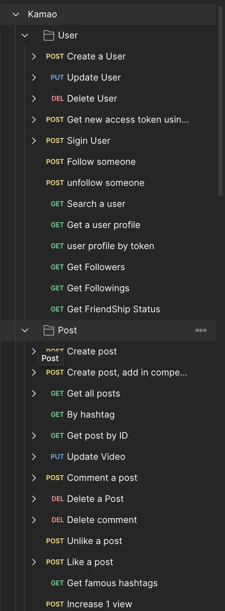

**EDIT 1: After many requests from users of this tools, I have decided to remove I prefix from the name of the interface**

Yeah, the title is kind of misleading. Who would not write typescript interfaces right? I am not saying to stop writing typescript interfaces, but automate it 🫡


> What ? How do we automate creating types ?

Postman is an API testing tool that can help us test API. It can be used to test API both locally and hosted. It also acts as a documentation for the API you are building and it is programming language independent.

Now, imagine this, you have full documentation for your API as a postman collection (A Postman collections can be thought of as a folder that contains requests or other collection inside it). Each collection in Postman can be downloaded/saved as a JSON file which has two schema versions. They are collection v2 and collection v2.1 and share the collection as a JSON file.


Now, lets come back to typescript and interfaces. An interface has a signature for a object that defines all the type of keys inside the object.
```ts
// example of a typescript interface
interface Human{
  name: string;
  age: number;
  isMarried: boolean;
}
```
Now imagine this is your collection. This collection here has more than 20 requests. Now lets create type for each requests, query parameters and for every response in the examples.



A simple typescript type can be created at around 10–15 seconds approximately (without AI tools) and can be created at around 5–7 seconds (with AI tools). Now lets calculate how much time does total interface creation takes? Very long right ? Now how about for 500 requests ? 1000 requests ?

But it only takes me 5 seonds to do 500 request. Wow really ? Actually yes. I have a small script that does it for me. It looks at the json file of collection export and generates the typescript types based on the content of the json and creates the typescript interface based on the name of the request or the response name and put the creates a folder with all the interfaces.

You can use this command.
```bash
npx @n1rjal/pm\_ts -i <input json file name> -o <output directory name>
```
Here

*   \-i means the input json file
*   \-o means the output directory where the types shall be placed

Now, lets try the command and see the results. Here is my work dir in vscode without runing the script.


Now lets run the script as
```bash
npx @n1rjal/pm_ts -i export.json -o types
```

Now a types folder is created with the following content


Now lets inspect one of the postman requests


Now lets see it equivalent type for body. The interface generated has the following content. See how the naming of the request and the url is mapped to the content of the file
```ts
/*
Calculate Winners
POST: {{host}}/competition/:compId/calculate/winners
*/
export interface ICalculateWinners {
  name: string;
  count: number;
  prizes: string[];
}
```
This script is now available and registered as a public script in npx and you can give it a star 🌟 if you like what I am doing here.

[**GitHub - n1rjal/postman-to-typescript: A simple nodejs script that looks into the postman…**
_A simple nodejs script that looks into the postman collection json and produces typescript interfaces - GitHub …_github.com](https://github.com/n1rjal/postman-to-typescript "https://github.com/n1rjal/postman-to-typescript")[](https://github.com/n1rjal/postman-to-typescript)
