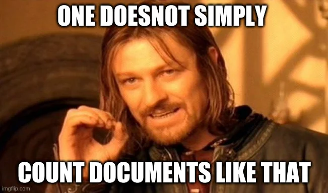

Hello everyone 👋👋

I created a MongoDB database with 10 million documents.😄 My schema is simple and is for a very very basic inventory management system.



## Before we begin
```
name: string,
quantity: number,
```
Here is a sample of some of the documents.

The schema looks simple enough but I have been working with a huge number of documents. To be precise, I am working with 12734005 documents. For those wondering how did I insert these documents here is the python code that helped me did it.

[Link to python Code](https://pastebin.com/8dmqMYc9)

## Let’s talk about count

> let’s find out which is better in which situation

By default, In MongoDB provides us with 3 different count methods.

*   countDocuments()
*   cursor.count()
*   estimatedDocumentCount()

### 1. countDocuments()

> it took somewhere between 4 to 10 seconds. Probably caching helped reduce its speed. Let’s discuss this below.

If you know aggregation, you can see that `countDocuments()` is the most accurate but slowest count query among the three. Behind the scene, it does a sequential scan, \*\* fancy way of saying goes through all documents \*\*, in all documents for the query gets the count. This is the slowest count I found.

> db.collection.countDocuments() wraps the following aggregation operation and returns just the value of n:
```
db.collection.aggregate([
       { $match: <query> },
       { $group: { _id: null, n: { $sum: 1 } } }
])
```
[Source: MongoDb Official Documentation](https://docs.mongodb.com/manual/reference/method/db.collection.countDocuments/)

### 2\. cursor.count()

MongoDB returns a cursor for `collection.find(<query>)` type of queries. The cursor has many methods and `.count()` is one of them. `cursor.count()` is same as `countDocuments()` but when its about `.find().count()` it returns count from collstats. It takes constant time

> _The collStats command returns a variety of storage statistics for a given collection._ [_Source : MongoDb official documentation_](https://docs.mongodb.com/manual/reference/command/collStats/)

### 3\. estimatedDocumentCount()

Unlike `cursor.count()` and `countDocuments()`, `estimatedDocumentCount()` does not take any query parameters. It returns the total count of documents. This is an estimated count. **But I think it is ok to return the estimated count as no one would actually bother about if the count is right or wrong up to million.** [Source : MongoDb official documentation](https://docs.mongodb.com/manual/reference/method/db.collection.estimatedDocumentCount/)

## Suggestions


1.  Don’t be that guy above
2.  Use `estimatedDocumentCount()` when counting total number of documents.
3.  Use `find.count()` when dealing with the counting of total number of documents with **query filters**
4.  Whenever **using query filters, always filter by indexes**, as it makes querying faster resulting in faster counts.
5.  Try **storing count with query filters in** a data store like **Redis or a new collection and update it periodically**.
6.  It is **better to use pre-computed counts** than to hog your database’s CPU.
7.  **Best way to deal with million documents is by not dealing with millions at one time.**

## Conclusion

I am not the “know all” type of guy. I might be wrong in this blog or you might have some better way to count the documents. Let’s discuss. I like to be proven wrong and I want an opportunity to learn from you guys as well but until then peace out. 😄
