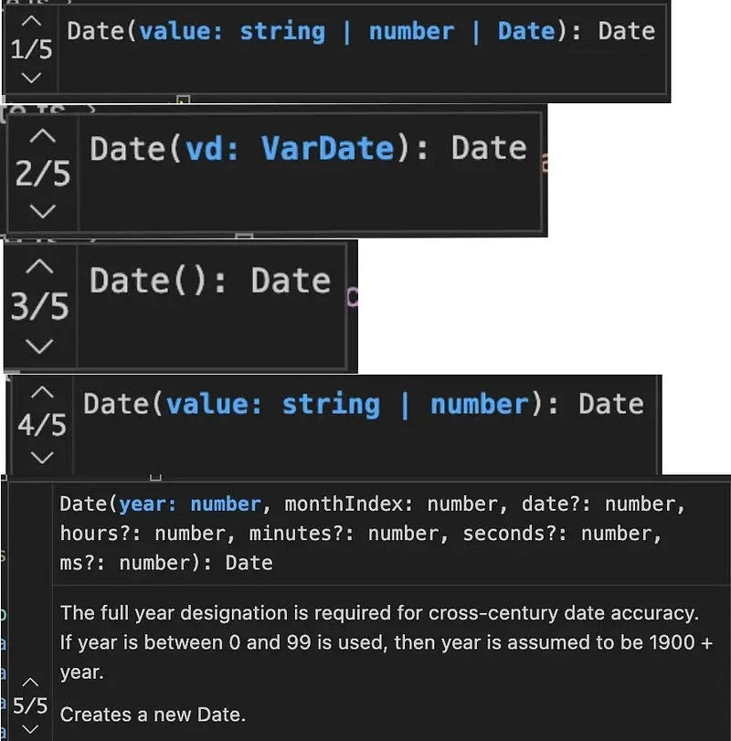

Whenever I was looking into the TypeScript Date class constructor implementation, I always wondered how its constructor signature worked like that, how it can have many signature, how can it work with 1st argument as number or string or an instance of itself. Every time I tried to implement the constructor signature in TypeScript using the documentation like TypeScript says I was getting type error shown below.


> I was working on [**node-nepali-datetime**](https://github.com/opensource-nepal/node-nepali-datetime) open source package in github.You might be thinking now that this is reinventing the wheel. The reason is that Nepal is around 60 years into the future. The first month of Nepalse calender, the **Bikram Sambat calender**, is Baisakh. It falls somewhere around April and has other similar features like the English (A.D) calender.

But whenever I looked into typescript implementation for date. I could see something that there were 5 different overload for date.



In the fifth constructor implementation, I obeserved that the [typescript doc string](https://www.typescriptlang.org/docs/handbook/jsdoc-supported-types.html) can be the reason behind this implementation then I tried putting doc string in places.
```ts
    /**
     * Creates NepaliDate instance from current date
     * @example new Date()
     */
    constructor()

    /**
     * Create NepaliDate instance from provided english date
     *
     * @param {Date} date
     *
     * @example
     * const nepaliDate = new NepaliDate( new Date('2020-01-01') )
     *
     */
    constructor(date: Date)

    /**
     * Create NepaliDate instance from using a provided english date
     * @param {NepaliDate} date: nepali date value provided as a value.
     * @example
     * const nepaliDateOld = new NepaliDate('2080-01-01')
     * const nepaliDate = new NepaliDate( nepaliDateOld )
     *
     */
    constructor(date: NepaliDate)

    /**
     * Create NepaliDate instance by parsing a provided string value
     * @param {string} value: string date time.
     * @example
     * const nepaliDate = new NepaliDate('2080-01-01')
     *
     */
    constructor(value: string)

    /**
     * Create NepaliDate instance by parsing a provided numeric value
     * @param {number} value: numeric value
     * @example
     * const n = new NepaliDate(new Date(373314600000))
     *
     */
    constructor(value: number)

    /**
     * Create NepaliDate instance by parsing a provided time string with format provided
     * @param dateString: string date time
     * @param format: string format of the date provided
     * @example
     * const n1 = new NepaliDate('2042/08/12 14-05-23.789', 'YYYY/MM/DD HH-mm-ss.SSS')
     *
     */
    constructor(dateString: string, format: string)

    /**
     * Creates a new instance of the Date class.
     *
     * @constructor
     * @param {number} year - The year.
     * @param {number} month - The month (0-11, where 0 is January and 11 is December).
     * @param {number=} day - The day of the month (1-31).
     * @param {number=} hour - The hour of the day (0-23).
     * @param {number=} minute - The minute (0-59).
     * @param {number=} second - The second (0-59).
     * @param {number=} ms - The milliseconds (0-999).
     *
     * @example
     * const [year, month, day] = [2080, 1, 12]
     * const hour = 12
     * const minute = 30
     * const second = 45
     * const ms = 500
     * const nd = new NepaliDate(year, month, day, hour, minute, second, ms)
     */
    constructor(        year: number,
        month: number,
        day?: number,
        hour?: number,
        minute?: number,
        second?: number,
        ms?: number    ) {}
```
Unforunately, the same type trouble still persisted, I tried looking into various ways of generalizing many overloads into a final constructor. Before my PR, the project had the following implementation
```ts
constructor(...args: any[]) {
        if (args.length === 0) {
            this._setDateObject(new Date())
        } else if (args.length === 1) {
            const e = args[0]
            if (typeof e === 'object') {
                if (e instanceof Date) {
                    this._setDateObject(e)
                } else if (e instanceof NepaliDate) {
                    this.timestamp = e.timestamp
                    this.year = e.year
                    this.yearEn = e.yearEn
                    this.month = e.month
                    this.monthEn = e.monthEn
                    this.day = e.day
                    this.dayEn = e.dayEn
                    this.hour = e.hour
                    this.minute = e.minute
                    this.weekDay = e.weekDay
                } else {
                    throw new Error('Invalid date argument')
                }
            } else if (typeof e === 'number') {
                this._setDateObject(new Date(e))
            } else if (typeof e === 'string') {
                // Try to parse the date
                this.set.apply(this, parse(e))
            } else {
                throw new Error('Invalid date argument')
            }
        } else if (
            args.length === 2 &&
            typeof args[0] === 'string' &&
            typeof args[1] === 'string'
        ) {
            const [dateTimeString, format] = args
            this.set.apply(this, parseFormat(dateTimeString, format))
        } else {
            this.set(
                args[0], // year
                args[1], // month
                args[2] ?? 1, // day
                args[3] ?? 0, // hour
                args[4] ?? 0, // minute
                args[5] ?? 0, // second
                args[6] ?? 0 // ms
            )
        }
    }
```
The above implemention is almost perfect but, then friendly neighbour hood **eslint** yelled about using any. I even considered making an exception to the rule using the following.

@typescript-eslint/no-explicit\-any

But this is an open source project and I was not bound by time limit or pressured to delievered fast and no one was depending on me for this. So, I decided to dive more deep into working of typescript and constructor.

Luckily, javascript has an awesome feature called [**arguments**](https://developer.mozilla.org/en-US/docs/Web/JavaScript/Reference/Functions/arguments%5C)**.** I tried to look into it to find out if it could be more helpful. This is how arguments work. I was a bit skeptical that it would throw a type error like other implementation but to my suprise it didn’t raise any type error in the editor.
```ts
function func1(a, b, c) {
  console.log(arguments)
  // Excepted output: 1, 2, 3

  console.log(arguments\[0\]);
  // Expected output: 1

  console.log(arguments\[1\]);
  // Expected output: 2

  console.log(arguments\[2\]);
  // Expected output: 3
}

func1(1, 2, 3);
```
The final constructor code looks something like this. No type errors are thrown and the code supports all the types correclty. After adding some typescript doc string. This code was good to go for me. **But there is a catch.**
```ts
    constructor()
    constructor(date: Date)
    constructor(date: NepaliDate)
    constructor(value: string)
    constructor(value: number)
    constructor(dateString: string, format: string)
    constructor(        year: number,
        month: number,
        day?: number,
        hour?: number,
        minute?: number,
        second?: number,
        ms?: number    )
    constructor() {
        if (arguments.length === 0) {
            this.\_setDateObject(new Date())
        } else if (arguments.length === 1) {
            const e = arguments\[0\]
            if (typeof e === 'object') {
                if (e instanceof Date) {
                    this.\_setDateObject(e)
                } else if (e instanceof NepaliDate) {
                    this.timestamp = e.timestamp
                    this.year = e.year
                    this.yearEn = e.yearEn
                    this.month = e.month
                    this.monthEn = e.monthEn
                    this.day = e.day
                    this.dayEn = e.dayEn
                    this.hour = e.hour
                    this.minute = e.minute
                    this.weekDay = e.weekDay
                } else {
                    throw new Error('Invalid date argument')
                }
            } else if (typeof e === 'number') {
                this.\_setDateObject(new Date(e))
            } else if (typeof e === 'string') {
                // Try to parse the date
                this.set.apply(this, parse(e))
            } else {
                throw new Error('Invalid date argument')
            }
        } else if (
            arguments.length === 2 &&
            typeof arguments\[0\] === 'string' &&
            typeof arguments\[1\] === 'string'
        ) {
            const \[dateTimeString, format\] = arguments
            this.set.apply(this, parseFormat(dateTimeString, format))
        } else {
            this.set(
                arguments\[0\], // year
                arguments\[1\], // month
                arguments\[2\] ?? 1, // day
                arguments\[3\] ?? 0, // hour
                arguments\[4\] ?? 0, // minute
                arguments\[5\] ?? 0, // second
                arguments\[6\] ?? 0 // ms
            )
        }
    }
```
The catch is that in the actual implemenation of the code where things gets executed, the types information is completely lost resulting in code that checks for every single possible combination of values among the many implemenation using **typeof, instanceof and arguments.length** combination. The **Date** code in the javascript is native C++ code, so it was not such helpful for me. But with proper doc string added this code from user prespective is close to the native Date constructor implementation as I can go.

I took this design descision and I think this really works for now, but if you have any suggestion on why this peice of code sucks or is not good. Let me know. I like to write about technology and programming in linkedin. So, lets get connected there. Here are my socials.

[https://www.linkedin.com/in/nirjalpaudel/](https://www.linkedin.com/in/nirjalpaudel/)

[**n1rjal - Overview**
_Curious about Tech | Nodejs 🩵 | Database 🔥 . n1rjal has 83 repositories available. Follow their code on GitHub._github.com](https://github.com/n1rjal/ "https://github.com/n1rjal/")[](https://github.com/n1rjal/)
