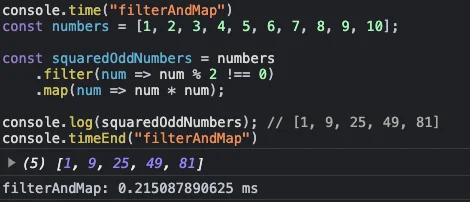

Tell me how many did you know by responding to the article and you may share this with your network to find out how many they know. These are some of the most underrated features in typescript. So, let's begin shall we?


## Using FlatMap

[Flat Map in javascript is a great technique which you can learn here](https://developer.mozilla.org/en-US/docs/Web/JavaScript/Reference/Global_Objects/Array/flatMap). Flat map essentially conbines techniques of map and filter Array method into one. I will suggest you to use flatMap() over combination of filter() and map().

> FlatMap takes single pass and doesn’t produce intermediate array but filter ()and map() combination produces an intermediate array.
```js
// using filterAndMap
console.time("filterAndMap")
const numbers = [1, 2, 3, 4, 5, 6, 7, 8, 9, 10];

const squaredOddNumbers = numbers
    .filter(num => num % 2 !== 0)
    .map(num => num * num)

console.log(squaredOddNumbers); // [1, 9, 25, 49, 81]
console.timeEnd("filterAndMap")
```


```js
console.time("filterAndMap")
const numbers = [1, 2, 3, 4, 5, 6, 7, 8, 9, 10];

const squaredOddNumbers = numbers.flatMap(num =>
    num % 2 !== 0 ? [num * num] : []
);


console.log(squaredOddNumbers); // [1, 9, 25, 49, 81]
console.timeEnd("filterAndMap")
```


## Order of Array methods

Array method are some of the most important methods that helps us to interact with an array. There are many array methods in javascript. Most popular array methods are **.filter(), .find(), .map(), .reduce()**. They can be merged together to produce some wonderful patterns like these
```js
// a array methods that sorts only the array
// for only odd numbers and raises it by power of 3
numbers
  .sort((a, b) => a - b)
  .filter((n) => n % 2 !== 0)
  .map((n) => n ** 3);
```

In a glance, the program above looks nice right but here is a big problem. Notice how we sorted for numbers 1st and then we moved on to filter right. We could have done **less task if we used filter 1st and then sort and raise the power**. This way, we can optimize a group of array methods chanined by (.)
The optimal code for above is

```js
const numbers = [9, 3, 6, 4, 8, 1, 2, 5, 7];

// a array methods that sorts only the array
// for only odd numbers and raises it by power of 3
numbers
  .filter((n) => n % 2 !== 0)
  .sort((a, b) => a - b)
  .map((n) => n ** 3);
```
## Not using reduce enough

I have seen this problem with a lot of frontend developers. While a package like react-charts asks data in object like structure and but the implementation of react-charts asks data in a format grouped by a key so I have seen most developers using .forEach() method or incorectly using map() method like these
```js
fetch("https://jsonplaceholder.typicode.com/todos/")
  .then(res=>res.json())
  .then(todos=>{

    // using Map
    const todosForUserMap = {};
    todos.forEach(todo=>{
      if (todosForUserMap[todo.userId]){
        todosForUserMap[todo.userId].push(todo);
      }else{
        todosForUserMap[todo.userId] = [todo];
      }
    })

    console.log(todosForUserMap)
  })
```

This method here is good as it uses forEach method and not map method. Map method is clearly not to be used here as an array will be build for each of the elements behind the scene. Lets say if array if of 1000 entries then a 1000 entries null array will be created in map, this creation of array will not happen in forEach()

Instead of using any of the methods shown above, a rather clean and readable approach would have been to use [**Array reduce method**](https://developer.mozilla.org/en-US/docs/Web/JavaScript/Reference/Global_Objects/Array/reduce) the above code is now corrected as
```js
fetch("https://jsonplaceholder.typicode.com/todos/")
  .then(res=>res.json())
  .then(todos=>{

    // using Map
    const todosForUserMap = todos.reduce((accumulator, todo)=>{
      if (accumulator[todo.userId]) accumulator[todo.userId].push(todo);
      if (!accumulator[todo.userId]) accumulator[todo.userId] = [todo];
      return accumulator;
    },{})

    console.log(todosForUserMap)
  })
```

This doesn’t create any unnecessary arrays and is much cleaner and is better to use. It is as similar to forEach() but I will suggest this as it is more cleaner and easier to understand.

## Not using Generators enough

Generators and Iterators are probably among those peice of code a javascript developers doesn’t use and its knowledge is only limited to coding interview. In data fetching scenario, the data can be unlimited in the database/API in huge volume and you will have to stream it in the frontend. In this case, the most used solution in react is the **infinite loading solution.**

> **How would you implement infinite loading like feature in nodejs server or vanilla javascript ?**

This is where iterators are really useful. Instead of streaming the flood of data in request in local storage or some places where you can retrieve for later uses. This is one of the methods of doing so using async generators. By this way we can solve infinite loading like problem in JS.
```js
async function *fetchProducts(){
  while (true){
    const productUrl = "https://fakestoreapi.com/products?limit=2";
    const res = await fetch(productUrl)
    const data = await res.json()
    yield data;
    // manipulate the UI here like
    // or save it in DB or somewhere else
    // use it as a side effect place
    // even if some condition matches, break the flow
  }
}

async function main() {
  const itr = fetchProducts();
  // this should be called based on user interaction
  // or other tricks as you don't want inifinite loading.
  console.log( await itr.next() );
}

return main()
```
## Not using native Javascript classes enough

Javascript comes pack with native javascript classes that can help you create/instantiate things like URL, Headers, etc pretty easily. We might have seen someone trying to query params in URL like this.
```js
async function getUrl(userId, limit, category){
  return `https://fakestoreapi.com/products${category ? `/category/${category}` : ""}${limit ? Number(limit):""}${userId? Number(userId):""}`;
}
```

The code above is messy and is likely to break and will require you to add some rule in the end each time, some other parameter is to be added, by using the native class like **URL** we can improve our code. Improved code looks like this.
```js
function constructURL(category, limit, userId) {
  const baseURL = "https://fakestoreapi.com/products";
  const url = new URL(baseURL);
  const params = new URLSearchParams();

  if (category) url.pathname += `/category/${category}`;
  if (limit) params.append('limit', Number(limit).toString());
  if (userId) params.append('userId', Number(userId).toString());

  url.search = params.toString();
  return url.toString();
}
```
This way, you can handle complex URL-building conditions within the same file. Did you know that the the URL object over here follows BuilderPattern, it is one of the many design patterns you can implement in your code to hide complex logic away in a separate place and it improves readability.

I like to write about technology and programming on LinkedIn. So, let's get connected there. Here are my socials where you can follow me.

[https://www.linkedin.com/in/nirjalpaudel/](https://www.linkedin.com/in/nirjalpaudel/)
[https://github.com/n1rjal/](https://github.com/n1rjal/)
