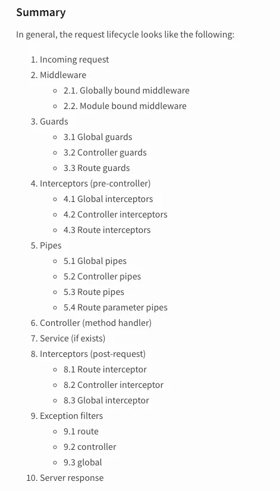

NestJS is a huge framework built on top of TypeScript, JavaScript also uses Express or Fasitfy as an underlying mechanism to route requests. It uses decorator-based syntax and the concept in NestJS is similar to that of Angular. The source code looks similar to that of Spring boot, Dotnet MVC. Similar in the sense that they all follow dependency injection and IOC principles.

> Nestjs is heavily inspired by Angular

I am trying to conclude the documentation of NestJS which can be found here. [https://docs.nestjs.com/](https://docs.nestjs.com/) in this writing.


I have been working on a code base built on nestjs for the last 3 years and I have seen how things changed over time in nestjs. Now, lets leave me out of the discussion and lets disscuss on tiny cute classes in nestjs and its functionalities. Shall we ?

## Controller

Controller as name suggest is a class that are used to define our routes to the class. It’s is decorated with Controller class and the decorator expects a url path string that will trigger its excution. Every methods in controllers are decorated with method specific decorators like Get, Post, Patch, Put, Delete and it assumes you provide it with a path.
```ts
@Controller('/user')
export class UserController {
  constructor(private readonly userService: UserService) {}


  // to signup user
  // GET: <baseUrl>/user/signUp
  @Post('signup')
  @Public()
  async signUpUser(@Body() signUpUserDto: SignUpUserDto) {
    return this.userService.signUpUser(signUpUserDto);
  }


  // to get user profile
  // GET: <baseUrl>/user/profile
  @Get('profile')
  async getUserProfile(@LoggedInUser() user: User) {
    return user;
  }

}
```
Each of the methods can also be decorated with decorators like @Body, @Query, or @Param that puts request body, query params or url path params into it. Each one of it expects a string to be provided to it which will map the string to the value there. See how userService is provided in controller and how it is being called even without an instance of it being provided.

## Service

Service is where our business logic resides. Generally, services are injected with other services or repository layers. Here is an example of service in Nestjs. Now here you can see that it has some other services and repositories in its parameter.

You saw the same in controllers as well, the object will be in place all thanks to Dependency injection and IOC container.
```ts
@Injectable()
export class UserService {
  constructor(    @InjectRepository(User)
    private readonly userRepository: BaseRepository<User>,
    private readonly em: EntityManager,
    private readonly authService: AuthService,  ) {}

  /**
   * This function creates a new user with email, password, and metadata, persists it to the database,
   * and returns a sign-in response for the newly created user.
   * @param {SignInUserDto} signUpUser - The parameter `signUpUser` is of type `SignInUserDto`, which
   * is likely a data transfer object containing information about a user signing up for an account,
   * such as their email and password.
   * @returns The function `signUpUser` returns a Promise that resolves to a `SignInResponse` object.
   */
  async signUpUser(signUpUser: SignInUserDto): Promise<SignInResponse> {
    const newUser = this.userRepository.create({
      email: signUpUser.email,
      password: signUpUser.password,
      metaData: this.INITIAL_BUDGET_METADATA,
    });
    await this.em.persistAndFlush(newUser);
    return await this.signInUser({
      email: signUpUser.email,
      password: signUpUser.password,
    });
  }


  /**
   * This function retrieves a user's profile by their ID and throws an exception if the user is not
   * found.
   * @param {string} userId - The `userId` parameter is a string that represents the unique identifier of
   * a user. It is used to search for a user's profile in the database.
   * @returns The function `getUserProfile` returns a Promise that resolves to a `User` object.
   */
  async getUserProfile(userId: string): Promise<User> {
    const userProfile = await this.userRepository.findOne({
      id: userId,
    });
    if (!userProfile) throw new NotFoundException('User not found');
    return userProfile;
  }

}
```
[**Learn more about dependency injection**
_Nest is a framework for building efficient, scalable Node.js server-side applications. It uses progressive JavaScript…_docs.nestjs.com](https://docs.nestjs.com/ "https://docs.nestjs.com/")[](https://docs.nestjs.com/)

These are the building block of nestjs but there are many other types of classes in nestjs, some of them are disscussed below in brief

Before we move into other classes, please remember this peice of information from nestjs



## Guards

*   Use for authorizing user
*   implements CanActivate Interface
*   logic in canActivate method
*   returns `boolean | Promise<boolean> | Observable<boolean>`
*   proceeds to next part of lifecycle on truthy result
*   apply globally or use @UseGuards() method
```ts
// example of guard thats accepts only medium authorization
@Injectable()
export class MediumGuard implements CanActivate {
  constructor() {}

  async canActivate(context: ExecutionContext): Promise<boolean> {
    const request = context.switchToHttp().getRequest();
    const token = this.extractTokenFromHeader(request);
    if (!token) {
      throw new UnauthorizedException();
    }
    try {
      if (token!=="medium")
          throw UnAuthorizedException("Use medium 😉")
    } catch {
      throw new UnauthorizedException();
    }
    return true;
  }
```
## Interceptors

*   use for modifying request or response
*   implements NestInterceptor
*   logic in intercept method
*   must know RxJS
*   apply it globally or use @UseInterceptors() method

```ts
import { Injectable, NestInterceptor, ExecutionContext, CallHandler } from '@nestjs/common';
import { Observable } from 'rxjs';
import { tap } from 'rxjs/operators';

// a simple logging interceptor
@Injectable()
export class LoggingInterceptor implements NestInterceptor {
  intercept(context: ExecutionContext, next: CallHandler): Observable<any> {
    console.log('Before...');

    const now = Date.now();
    return next
      .handle()
      .pipe(
        tap(() => console.log(`After... ${Date.now() - now}ms`)),
      );
  }
}
```
## Pipes

*   Use for validation/transformation of controller params
*   [Use builtin pipes for validation](https://docs.nestjs.com/pipes#built-in-pipes) by providing
*   Provide as second parameter to @Param(), @Body() or @Query() or use globally,
*   For custom Pipe,
*   create a class which implements PipeTransform
*   custom logic in transform method

```ts
import { ArgumentMetadata, Injectable, PipeTransform } from "@nestjs/common";
// a simple comma seperated string value to array transform pipe
@Injectable()
export class ParseCommaSeparatedPipe<I extends string, J>
  implements PipeTransform
{
  commaRegex = /[,]/;

  transform(value: I, metadata: ArgumentMetadata): J[] {
    if (value.length === 0) return [];

    return value.split(",").map((item) => item as J);
  }
}
```
## Filters

*   can be though of as a catch block like in cpp or python
*   can be generic catch or specific catch
*   code in catch() method
*   Decorated by Catch decorator which takes HttpException
```ts
import { ExceptionFilter, Catch, ArgumentsHost, HttpException } from '@nestjs/common';
import { Request, Response } from 'express';

@Catch(HttpException)
export class HttpExceptionFilter implements ExceptionFilter {
  catch(exception: HttpException, host: ArgumentsHost) {
    const ctx = host.switchToHttp();
    const response = ctx.getResponse<Response>();
    const request = ctx.getRequest<Request>();
    const status = exception.getStatus();

    response
      .status(status)
      .json({
        statusCode: status,
        timestamp: new Date().toISOString(),
        path: request.url,
      });
  }
}
```
There are many other types of classes in nestjs. which you can find in the official docs. I do nestjs most of the time and make sure you respond with what I left here. I may do part 2 and may write many things on nestjs. if you love it.

[**Documentation | NestJS - A progressive Node.js framework**
_Nest is a framework for building efficient, scalable Node.js server-side applications. It uses progressive JavaScript…_docs.nestjs.com](https://docs.nestjs.com/ "https://docs.nestjs.com/")[](https://docs.nestjs.com/)

I like to write about technology and programming on LinkedIn. So, let’s get connected there. Here are my socials where you can follow me.

[https://www.linkedin.com/in/nirjalpaudel/](https://www.linkedin.com/in/nirjalpaudel/)
[https://github.com/n1rjal/](https://github.com/n1rjal/)
