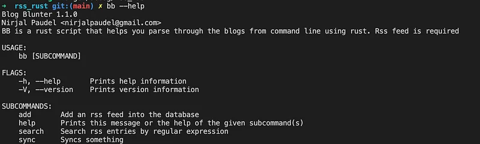
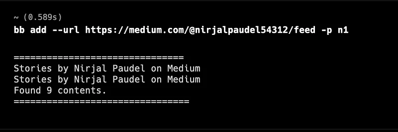
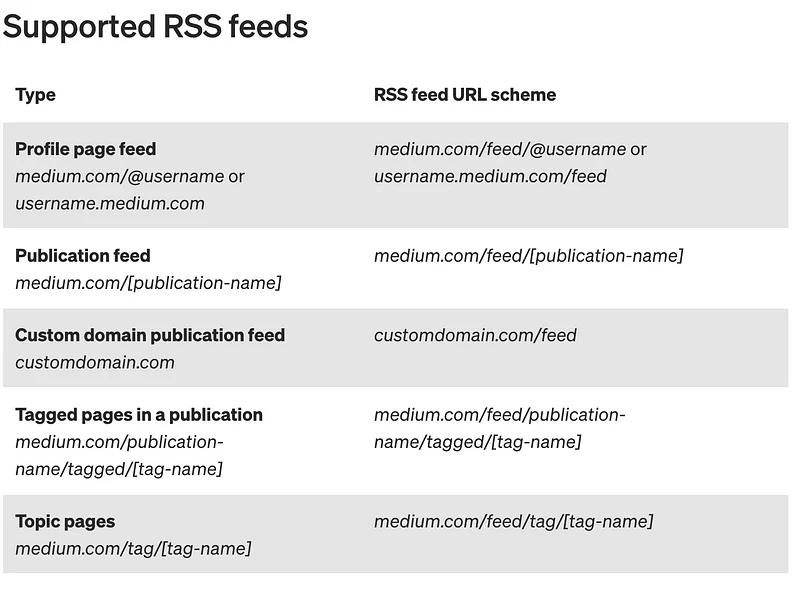
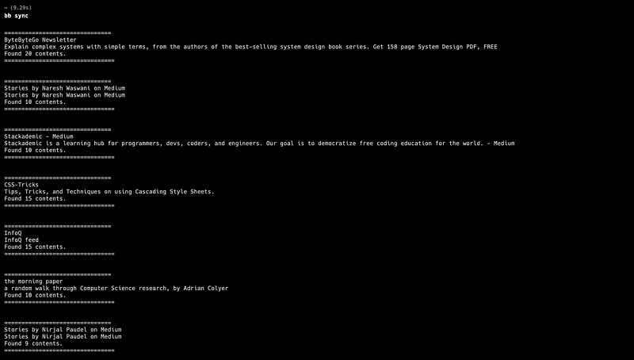
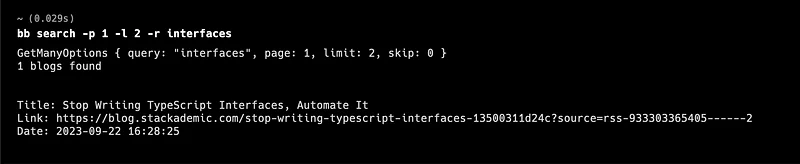

I have been diving into the working of rust and I am loving how rust is just opposite of my primary language like typescript/javascript enums and structs just works like C++ or C. I am loving rust and will probably add more content on comparing rust with typescript.

The CLI tool is linked to the github repository below. Do give a visit and decide if it is worthy of a star or not.

[**GitHub - n1rjal/rss\_rust\_parser: A rss parser built on rust**
_A rss parser built on rust. Contribute to n1rjal/rss\_rust\_parser development by creating an account on GitHub._github.com](https://github.com/n1rjal/rss_rust_parser "https://github.com/n1rjal/rss_rust_parser")

> Note that this is my 1st project in rust which can be useful in my daily life and I think there is huge space of improvement and I am open to feedback.

The tool mentioned here can be a great tool or some sort of timewaste depending upon how you feel. I build it whilst I was learning rust.

It does 3 tasks:

**Source Adding**

It simply means that we are adding a source for a blog provider. A blog provider can be many things like a medium publication, medium user or any blog providers that support rss feed and obeys the structure declared in the source code.

To get source of your favorite blogger, technical writer please use any of these rules

**Syncing**

Syncing is simply the process of adding the latest blogs from all of the source. The command is simple. It loops through all the source and parses the latest blogs from every single one of the sources.

**Searching**

Searching is a process where you search for blogs based on the title based on LIKE query in sqlite and has and features like page number and limit.

In a modern terminal like warp, I can click the url here and read the blog over there.

**Technology Used**

1.  **Rust:** Programing language
2.  **Serde:** For seralizing and deserialzing
3.  **Clap:** For building command line args
4.  **Tokio:** For async await support
5.  **serde_xml_rs:** For parsing rss xml document

**Want to use it ?**

1.  Clone the github repository
2.  Install rust in your system
3.  project dependencies using **cargo install**
4.  Build the executable using **cargo build** command
5.  Add the executable in your **$PATH**

**Future Plans:**

1.  Support for more rss xml schemas
2.  Make it able to parse youtube channels, itunes, hackernoon general rss feed xml too.
3.  Add **axum based rest api** support
4.  Schedule syncing process every 5 hours
5.  Add support with **local notifications** in Mac, Windows and Linux
6.  **Enable siri** to work with it.

I like to write about technology and programming on LinkedIn. So, let’s get connected there. Here are my socials where you can follow me.

 - [https://www.linkedin.com/in/nirjalpaudel/](https://www.linkedin.com/in/nirjalpaudel/)
 - [https://github.com/n1rjal/](https://github.com/n1rjal/)
