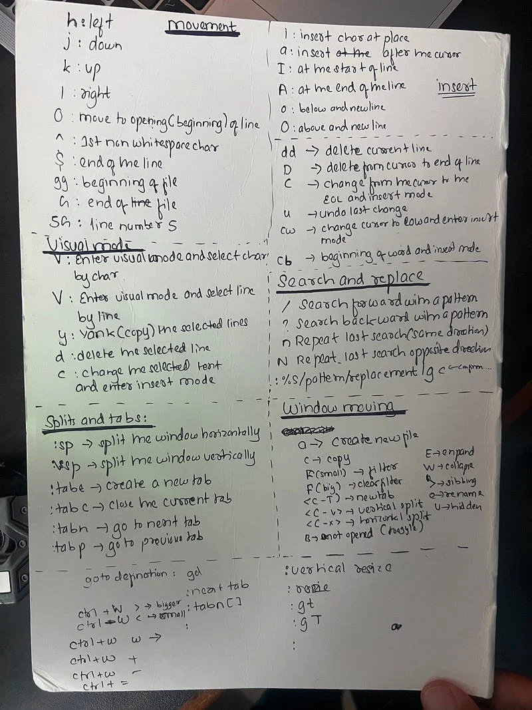
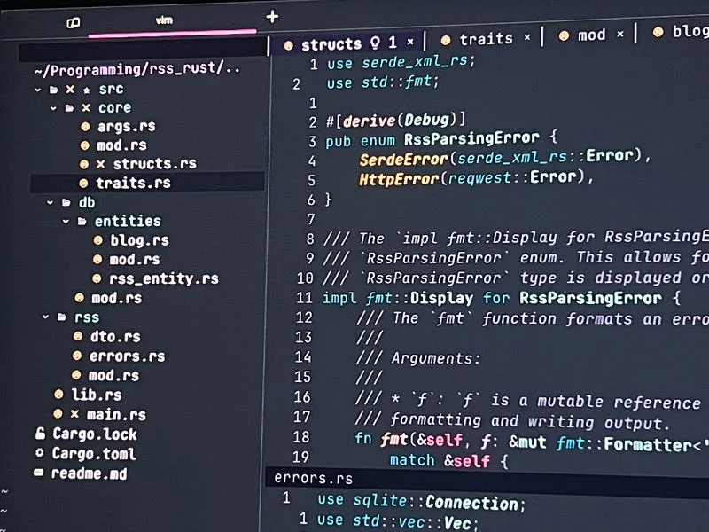

Vim has been throne till my software development. Something that I always ignored and looked away from. Here I would love to reverse time a by few years and see how my programming journey went and vim has made the journey better making me a more productive software enginner overall. By the way, fireship has the best introduction video about neovim

> [Learn about neovim in 100 seconds](https://www.youtube.com/watch?v=c4OyfL5o7DU)

## My journey

I have been loving computer in a general, I have worked on many projects from many domains like learning management system, ecommerce and Saas. I have worked on various solo projects like some fun script in python like the one is linked below.

As you can see there, I was using python IDLE as a text editor. Aaah ! such a boring guy, you might have thought. I never knew about the existence of Visual Studio Code and my pc couldn’t handle pycharm at that time. After some time, I found about Visual Studio Code from a facebook post or something, I forgot the source. VS Code was pretty much charming me. Being able to see many file sources at the same time blew my mind. I started with vscode and never switched to any other IDE.

This period is what i would say is my **dark ages** in my programming journey. I went from removing so many application from my computer to support vscode. Until I couldn’t keep up with vscode resources consumption and extensions extending the resources.

## Coming Across Vim

I never knew anything about the terminal based editor that I love today. But I only came across vim when I tried to merge the branch through the vscode intergrated terminal. Then I couldn’t figure out how to do **:wq** so I killed the terminal window 😩

After nth ocuurances with the problem, I figured out that I need to do something with this. I searched the error and straight away I swicthed the git terminal to use **nano.** I didn’t have any mate or colleagues to guide me with the process of switching to vim.

## Few years passed

Now I am a working software developer with 2 years of experience and I am using MacOS now. So shoutout to apple. Using a better PC, made me ignore vim for some years. Once, when I was doing ssh into the server, as default server option for text editor is vim in ubuntu. And on every machine, I was getting tired of doing the same thing of replacing the default text editor. So, I decided to use vim. Please note that I only did copy paste form the clipboard and wiritng and saving the file. I still used arrow keys to navigate. 🥺

## Extension Crisis

After some times, I had around 30 extension in my visual studio code and I had to do my development using docker. Extensions like codeium and browsers like brave browsers were smoking my PC. I figured out that this is a real problem for me and i tried to figure out solutions for it. I thought of using new text editor but nothing is as great for web development like visaul studio code. And by this time, I was watching content from a popular youtube channel, The primeagen

[**ThePrimeTime**
_This is a place for all the things that are awesome on stream._www.youtube.com](https://www.youtube.com/@ThePrimeTimeagen "https://www.youtube.com/@ThePrimeTimeagen")

> Primeagen is one of the few youtubers who gives you valuable tech advise and content plus his perosnality and presentation is so appealing for folks like me. He also brags about neovim which may or mayn’t have influenced me 😉

## So, how did I started vimming ?

NvChad, a popular beginner friendly neovim plugin that made me come into neovim but using NvChad I couldn’t find any fun. So, I told Primeagen “Sensi” and started seeing his starting video, as I was used to with vim movements and was using vim sometimes editing server conf files, creating services and working on ubuntu server.

> [Primeagen Youtube video](https://www.youtube.com/watch?v=w7i4amO_zaE)

## Shortcuts weren’t short to learn

Apart from hjkl and :wq and :%d I knew nothing about neovim or vim mappings. I decided that this is the time to learn neovim and wrote all the shortcurts in a paper and put it aside my working place. Here is a photo of shortcuts and you can use it if you are a vim beginner.

## Why better ?

Now, it been a couple of month I have used neovim and I am loving the neovim. I used to do a lot of mistakes when I used to type code. Now using neovim, the mistakes have been cut down by many and now my hands can move pretty easily and fluently and I can also argue that my WPM has increased too. Neovim is basically the fastest editor I haved used and it can be customized to look and feel like vscode too. I would certainly say that my productivity has increased and I love it.

I do rust, python, javascript and laravel in neovim. I am loving neovim and I think I will not moving away from it in the near future. I am using [**warp terminal**](https://www.warp.dev/) and I am loving my workflow with neovim. Now, I can power of using one visual studio code per terminal tabs. 😆 This is how my development looks now.

Here is my neovim config as a github repo. Mostly it is as similar as that of the above primeagen’s video.

[**GitHub - n1rjal/init.lua: My neovim config contains lsp, keymaps, etc**
_My neovim config contains lsp, keymaps, etc. Contribute to n1rjal/init.lua development by creating an account on…_github.com](https://github.com/n1rjal/init.lua "https://github.com/n1rjal/init.lua")

I like to write about technology and programming on LinkedIn. So, let’s get connected there. Here are my socials where you can be a part of my disscussions.

[https://www.linkedin.com/in/nirjalpaudel](https://www.linkedin.com/in/nirjalpaudel)/
