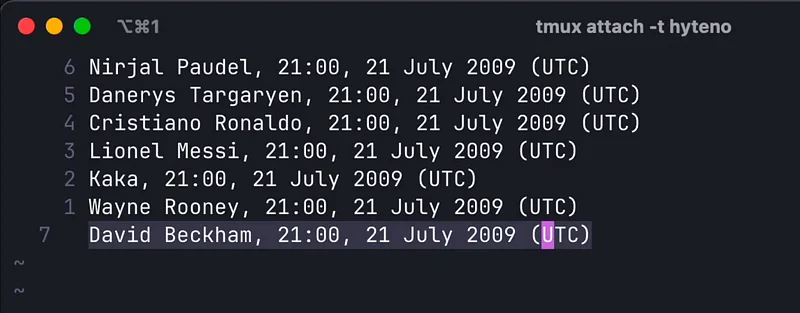
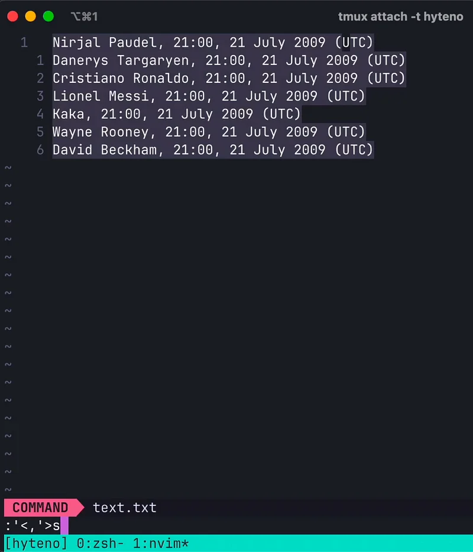
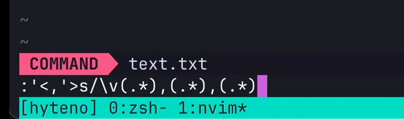
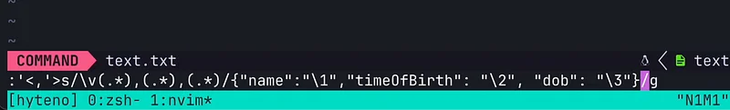
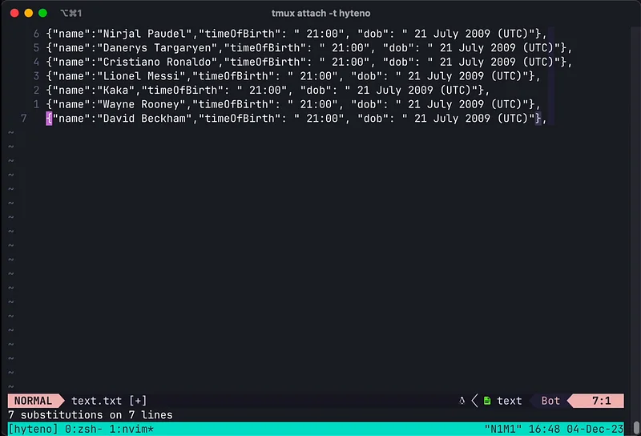

In Neovim, the scope that regular expression select group is out of this world. Here is a screencast of me making a json object out of just text data. 🧑‍💻


Neovim has been one of those tool, that I had been procastinating on for majority of my carrer. Now, I have come to embrace it and I am a month old neovim users. You can read more about this here.

[**My journey to VIM, from 😕 to 😄**
_Vim has been throne till my software development. Something that I always ignored and looked away from. Here I would…_blog.stackademic.com](https://blog.stackademic.com/my-journey-to-vim-from-to-67e06a2898a1 "https://blog.stackademic.com/my-journey-to-vim-from-to-67e06a2898a1")[](https://blog.stackademic.com/my-journey-to-vim-from-to-67e06a2898a1)

Here our text input follows a pattern. Pattern like of a csv file. Fields are separated by comma ,



We will have to select that and use the find and replace command. The keybinding for that is
```bash
:'<,'>s/
```


You will only need to press :s as :’<,’> comes due to selection done in the visual line mode

The syntax for the find and replace command is
```bash
s/<input\_regex>/replacement string/gc
```
Here,
g,c are flags like global means all and c means confirmation.
It will ask for prompt

Select groups are those characters that are based upon the values provided in the input selection regular expression.



Here using \\v means that we willn’t have to escape brackets. In the above example. the target groups are

(\*.), (\*.), (\*.) -> Everything from beginning till 1st comma, Between 1st and 2nd comma and everything else. We can reference those selection group on the replace part using \\1 \\2 and \\3 in the right side. \\0 means everything. It is like the syntax in the awk command. I also used some json like fields to add extra text in the replace side.



If you guessed the replace part, you can see that the output of this must look like some JSON structure. You are right.🥳 So final output looks like this.



Tricks like this has made something more effective in me and I love tricks. You might have some tricks that I may not know. Share me your NeoVim tricks.

I want to find a way to reference registers in the replace part of find and replace. Imagine if we could use register content in replace part. This is what I will be looking into.
[#neovim](https://www.linkedin.com/feed/hashtag/?keywords=neovim&highlightedUpdateUrns=urn%3Ali%3Aactivity%3A7137400671321952257) [#vim](https://www.linkedin.com/feed/hashtag/?keywords=vim&highlightedUpdateUrns=urn%3Ali%3Aactivity%3A7137400671321952257) [#programming](https://www.linkedin.com/feed/hashtag/?keywords=programming&highlightedUpdateUrns=urn%3Ali%3Aactivity%3A7137400671321952257)
