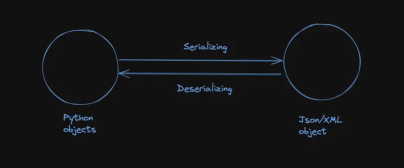
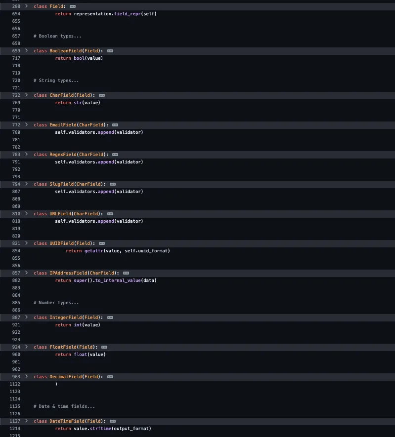
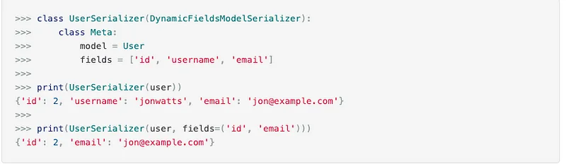

Django has always been a quick go to framework that I mostly use when I need some result quickly. Start with the server or when I want to set up a quick server. DRF is used to create rest framework on top of Django. It has various components like viewsets, routers, serializes, etc. This article is going to be about serializer only.

## The need of serializer

Serializing and deserializing is the process of converting a value from one representation to another. It acts as a translator that translates one form of data to another and vice versa.



## Serializer vs Model Serializer

Serializer in DRF is the class that is responsible for changing one form of object to another. Mostly python object to JSON and vice versa. It has various fields shown below



I highly suggest you look into the documentation.

[**django-rest-framework/rest\_framework/fields.py at master · encode/django-rest-framework**
_Web APIs for Django. 🎸. Contribute to encode/django-rest-framework development by creating an account on GitHub._github.com](https://github.com/encode/django-rest-framework/blob/master/rest_framework/fields.py "https://github.com/encode/django-rest-framework/blob/master/rest_framework/fields.py")[](https://github.com/encode/django-rest-framework/blob/master/rest_framework/fields.py)

Model Serializer is an abstract form of Serializer. It makes it easy to make a serializer for a Django model. If we look into the source code. There you will see a mapping from Django models fields to DRF serializer fields.

```python
class ModelSerializer(Serializer):
    """
    A `ModelSerializer` is just a regular `Serializer`, except that:

    * A set of default fields are automatically populated.
    * A set of default validators are automatically populated.
    * Default `.create()` and `.update()` implementations are provided.

    The process of automatically determining a set of serializer fields
    based on the model fields is reasonably complex, but you almost certainly
    don't need to dig into the implementation.

    If the `ModelSerializer` class doesn't generate the set of fields that
    you need you should either declare the extragdiffering fields explicitly on
    the serializer class, or simply use a `Serializer` class.
    """
    serializer_field_mapping = {
        models.AutoField: IntegerField,
        models.BigIntegerField: IntegerField,
        models.BooleanField: BooleanField,
        models.CharField: CharField,
        models.CommaSeparatedIntegerField: CharField,
        models.DateField: DateField,
        models.DateTimeField: DateTimeField,
        models.DecimalField: DecimalField,
        models.DurationField: DurationField,
        models.EmailField: EmailField,
        models.Field: ModelField,
        models.FileField: FileField,
        models.FloatField: FloatField,
        models.ImageField: ImageField,
        models.IntegerField: IntegerField,
        models.NullBooleanField: BooleanField,
        models.PositiveIntegerField: IntegerField,
        models.PositiveSmallIntegerField: IntegerField,
        models.SlugField: SlugField,
        models.SmallIntegerField: IntegerField,
        models.TextField: CharField,
        models.TimeField: TimeField,
        models.URLField: URLField,
        models.UUIDField: UUIDField,
        models.GenericIPAddressField: IPAddressField,
        models.FilePathField: FilePathField,
    }
    if hasattr(models, 'JSONField'):
        serializer_field_mapping[models.JSONField] = JSONField
    if postgres_fields:
        serializer_field_mapping[postgres_fields.HStoreField] = HStoreField
        serializer_field_mapping[postgres_fields.ArrayField] = ListField
        serializer_field_mapping[postgres_fields.JSONField] = JSONField
    serializer_related_field = PrimaryKeyRelatedField
    serializer_related_to_field = SlugRelatedField
    serializer_url_field = HyperlinkedIdentityField
    serializer_choice_field = ChoiceField
 ```

\# continue reading the source at https://github.com/encode/django-rest-framework/blob/master/rest\_framework/serializers.py#L889

### Serializer Methods:

In particular, if a \`data=\` argument is passed, then:

*   is\_valid() — Available.
*   initial\_data — Available.
*   validated\_data — Only available after calling \`is\_valid()\`
*   errors — Only available after calling \`is\_valid()\`
*   data — Only available after calling \`is\_valid()\`

If a \`data=\` argument is not passed, then:

*   is\_valid() — Not available.
*   initial\_data — Not available.
*   validated\_data — Not available.
*   errors — Not available.
*   data — Available.

There are few other methods that can be used with a serializer, but you must define it yourself (for Serializer class) but it is not required for Model serializers meaning that you can save time using Model Serializer

*   create(): A serializer method used to create data using the serializer’s validated data. Not implemented by default
*   update(): Update the instance passed to the serializer using the new validated data
*   delete(): Delete the instance passed to the serializer
*   validate\_<fieldname>(): Used to validate single value for a particular field

## Make serializer for some common use cases

There is no right or wrong way on where to put your business logic in Django. But with the introduction of Django rest framework serializer and the various built-in classes it provides like Viewsets, Generics, etc. We could use serializer as the way to hold our business logic or way to perform some tasks that are a bit hard. Plain Serializer will help you a lot in doing so. Here is a plain serializer that will help us upload a file to R2.

```python
class FileUploadSerializer(serializers.Serializer):
    file = serializers.FileField(required=True, write_only=True)
    key = serializers.CharField(required=True)
    file_url = serializers.SerializerMethodField(read_only=True)

    def get_file_url(self, obj):
        if not obj:
            return None
        if hasattr(obj, "key"):
            return obj.key
        if obj.get("key"):
            return boto3.get_presigned_url(obj.get("key"))
        return None

    def validate_key(self, value):
        if not value:
            raise serializers.ValidationError("Key is required")
        return value

    def create(self, validated_data):
        # here file is temporary file
        file = validated_data.pop("file")
        key = validated_data.get("key")
        boto3.upload_temporary_file_to_s3(file, key)
        return validated_data

```

> R2 is an alternative to S3 provided by Cloudflare and is too cheap compared to what AWS charges. Downside being that there is no way to replicate data. But it doesn’t incur bandwidth out charge.

## Use SerializerMethodField for custom get logic

You can also use SerializerMethodField() to put custom business logic in the viewsets. This is particularly useful when using doing some complex operation on the data. Here is an example where I get pre-signed URL from R2

```python
class PostSerializer:
    mp3_url = serializers.SerializerMethodField(read_only=True)
    like_id = serializers.SerializerMethodField(read_only=True)

    seconds_played = serializers.SerializerMethodField(read_only=True)


    def get_seconds_played(self, obj):
        request = self.context.get("request")
        if not request:
            return 0
        if not request.user.is_authenticated:
            return 0

        beats_played = BeatPlay.objects.filter(user=request.user, beat=obj).first()
        print("beats_played", beats_played)
        if not beats_played:
            return 0
        return beats_played.seconds_played

    def get_like_id(self, obj):
        request = self.context.get("request")
        if not request:
            return None
        if not request.user.is_authenticated:
            return None

        like = BeatLike.objects.filter(user=request.user, beat=obj).first()
        if like:
            return like.pk
        return None

    def get_mp3_url(self, obj):
        return boto3.get_presigned_url(obj.mp3)
```
## Serializer Context:

Serializer context is an extra dict argument passed with the serializers so that it can be used later on from within the serializer. It is generally used to pass the request to the serializer and later in the data validation or any of the serializer methods.

```python
from rest_framework import serializers
from examples.models import Resource

resource = Resource.objects.get(id=1)
serializer = ResourceSerializer(resource, context={'key': 'value'})

Then you can fetch it inside the serializer class from the `self.context` dictionary like so:

from rest_framework import serializers
from examples.models import Resource

class ResourceSerializer(serializers.ModelSerializer):
    class Meta:
        model = Resource
        fields = '__all__'
    def to_representation(self, instance):
        representation = super().to_representation(instance)
        representation['key'] = self.context['key']
        return representation
```

Our serializer output will now contain `key` with `value`. This is also useful when you want to get in user specific data. Say **get\_user\_has\_liked\_the\_post** method. This output of this method is relative to each user, and for the serializer field method we can use self.context and user to get the like\_id of the user.

```python
class BeatSerializer(serializers.ModelSerializer):
    like_id = serializers.SerializerMethodField(read_only=True)

    def get_like_id(self, obj):
        request = self.context.get("request")
        if not request:
            return None
        if not request.user.is_authenticated:
            return None

        like = BeatLike.objects.filter(user=request.user, beat=obj).first()
        if like:
            return like.pk
        return None
```

To pass in the context to serializer we use \`context=\` parameter.
>  [Dynamically modifying fields](https://www.django-rest-framework.org/api-guide/serializers/#dynamically-modifying-fields)

Once a serializer has been initialized, the dictionary of fields that are set on the serializer may be accessed using the `.fields` attribute. Accessing and modifying this attribute allows you to dynamically modify the serializer.

Modifying the `fields` argument directly allows you to do interesting things, such as changing the arguments on serializer fields at runtime, rather than at the point of declaring the serializer.

```python
class DynamicFieldsModelSerializer(serializers.ModelSerializer):
    """
    A ModelSerializer that takes an additional `fields` argument that
    controls which fields should be displayed.
    """

    def __init__(self, *args, **kwargs):
        # Don't pass the 'fields' arg up to the superclass
        fields = kwargs.pop('fields', None)

        # Instantiate the superclass normally
        super().__init__(*args, **kwargs)

        if fields is not None:
            # Drop any fields that are not specified in the `fields` argument.
            allowed = set(fields)
            existing = set(self.fields)
            for field_name in existing - allowed:
                self.fields.pop(field_name)
```


This is how we can change update Django serializers to load dynamic fields.

But these are not the only tricks that you can achieve in serializers. There are many other tricks. Why not do one thing ? You comment your tricks so that the medium Django devs can learn from it. 😌

[Oh Hello, thanks for staying till the end. Do you know I am available on LinkedIn too? Let's connect there, dear.](https://www.linkedin.com/in/nirjalpaudel/) Click me pita shree 🤌

Also, I have a template for quick Django projects. Comes preinstalled with Django, DRF, celery, CORS headers, etc. Why not give a look

[**GitHub - n1rjal/djate: My Django template to use**
_My Django template to use. Contribute to n1rjal/djate development by creating an account on GitHub._github.com](https://github.com/n1rjal/djate "https://github.com/n1rjal/djate")[](https://github.com/n1rjal/djate)
