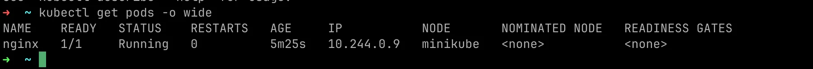

This writing is about my learning with kubernetes. This blog might be a quick look for my day to day uses with kubernetes. Hope you like it 🤌

## Kubernetes Workload

- An app in k8
- Pod is atomic workload
- Replicaset
- Deployment
- StatefulSet
- DeamonSet
- Task that run to completion
    - Job
    - CronJob

<aside>
⚠️ To get all the objets in kubernetes created

```bash
> kubectl get all
> We can ssh into kubernetes node
```

</aside>

## Kubernetes Pods

<aside>
⚠️ We should assume that

- App is in docker hub as docker image
- Kubernetes cluster is already setup
</aside>

### Pod

- Is a single instance of an application
- Smallest object that can be created in Kubernetes
- Has 1:1 relationship with your application (mostly)

<aside>
💡 We scale by adding more pods in either in same node or in a different node in the same cluster
</aside>

### Multi-container pods

- Helper container like scenario
- When we want to keep up
- Same network space and [localhost](http://localhost) connection and the same storage space.

To deploy container

```bash
# kubectl running nginx pod simple
kubectl run nginx —image nginx

# get the status of all the pods in the system
kubectl get pods
```

### Minikube Workshop

```bash
### MINIKUBE DEMO

# Create a deployment
kubectl create deployment hello-minikube --image=k8s.gcr.io/echoserver:1.10

# To get all the deployments
kubectl get deployments

# Expose deployment uisng nodeport --port=8000
kubectl expose deployment hello-minikube --type=NodePort --port=8080
service/hello-minikube exposed

```

### Pod Workshop

```bash
### Pods Workshop

# requires imge to use it
kubectl run nginx --image=nginx

# kubectl get pods to get the  pods
kubectl get pods
```

<aside>
📌 Flag -o is used to get the ip address of the nodes too within the cluster



</aside>


Containers will be creating to created state


```bash

kubectl describe pod <pod_name> # is more detailed compared to get pod
```

- Learn more about describe
    - Events
        - All the events which ran after the creation of pod
    - Containers

    


### Making pod using YAML in kubernetes

<aside>
📌 `kubectl [create|apply] -f pod-definition.yml`

</aside>


```yaml
## This must be named pod-defination.yml file

apiVersion: v1 # Version of kubernetes api # Depends upon which we want to make
kind: Pod # POD, Service, ReplicaSet, Deployment
metadata:
  name: myapp-pod
  labels: # custom keyvalue pair put any thing you want
  app: myapp
  type: front-end
spec:
  containers:
    - name: nginx-container
      image: nginx # name of docker image in image repo

```

---

## Kubernetes ReplicationControllers and ReplicaControlSet

- To run more than one pod in the node.
- Ensures that the required setup is met for number of pods
- For **load balancing and Scaling**

### Replication Controller vs Replica set

Replication Controller:

- older tech
- replaced by replica set


<aside>
📌 kubectl create -f rc-defination.yml

## Kubernetes Replicasets[ In depth ]

<aside>
⚠️ Recommended way is to create Deployments because of extra functionalities on top of replicaset

</aside>

- Primary method of managing pod replicas and their lifecycle to provide self-healing capabilities
- Their job is to always ensure the desired number of pods are running


</aside>

```yaml
# Replication Controller

apiVersion: v1
kind: ReplicationController
metadata:
  name: myapp-rc
  labels:
    app: myapp
    type: front-end
spec:
  replicas: 3

  template:        # As same as for pod
    metadata:
      name: myapp-pod
      labels:
        app: myapp
    spec:
      containers:
      - name: nginx-container
        image: nginx

```

<aside>
📌 We want to label everything in kubernetes, Labelling is like class name and we can filter by labels and selectors

</aside>

```yaml
# Replication-set Controller

apiVersion: apps/v1
kind: ReplicationController
metadata:
  name: myapp-rc
  labels:
    app: myapp
    type: front-end
spec:
  replicas: 3
  selector:        # major difference
		 matchLabels:
		   type: myapp # matching the myapp

  template:        # As same as for pod
    metadata:
      name: myapp-pod
      labels:
        app: myapp
    spec:
      containers:
      - name: nginx-container
        image: nginx

```

---

## Kubernetes Deployment


- For production
- For updates: Blue green, Rolling, Rollback etc
- Object higher than replica-set
- Create on template for each microservice

<aside>
⚠️ Rolling update is the default strategy for deployment

</aside>


```yaml
apiVersion: apps/v1
kind: Deployment
metadata:
  name: nginx-deployment
spec:

  template:
    metadata:
      labels:
        app: nginx
    spec:
      containers:
      - name: nginx
        image: nginx:1.14.2
        ports:
        - containerPort: 80

  replicas: 3
  selector:
    matchLabels:
      app: nginx

```


### Updates

- Changes replicaset from 5 to 0 in old version
- Changes replicaset from 0 to 5 in new version
- And vice versa in rollback

---

## Kubernets DaemonSet

- Ensure all nodes (or a subset) run an instance of a Pod
- Scheduled by the scheduler controller and run by the daemon controller
- As nodes are added to the cluster, Pods are added to them
- Typical uses
    - Running a cluster storage daemon
    - Running a logs collection daemon on every node
    - Running a node monitoring daemon on every node


---

## Kubernetes StatefulSet

- For Pods that must persist or maintain state


---

## Kubernetes Networking

<aside>
📌 In kubernetes, IP is assigned to pods. 10.244.x.x
Subject to change when pods are recreated

</aside>

<aside>
📌 In kubernetes, IP is assigned to nodes too.

</aside>

- Kubernetes doesn’t setup any networking for us
- We should setup networking ourself
- KUBERNETES EXPTECTS THIS
    - All PODs can communicate to one another without NAT
    - All nodes can communicate with al containers and vice versa without NAT

---

## Kubernetes Services

- Services enables connectivity between various parties
- Loose coupling between microservices
- Connection between FE to BE, Users to FE, etc


### NodePort

- Listens to the port and forwards it to node port

ClusterIP

-

---

## Kubernetes Namespaces


<aside>
📌 Create namespace in morning, assign it resources/objects and end of the day, delete it and remove all of it


</aside>


---

## Kubernetes Job


### Cronjob In UTC


---

## Storage and Persistent volume data

## Volumes


### Storage - Static Way

- Persistent Volumes
    - Represnts a storage resource
    - Cluster wide
    - Provisoned by an admin
- Persistent Volume Claim
    - A one to one mapping to persistent volume
- One or more pods can use a persistent volume Claom
- Can be consumed by any of the conatiners within the pod


## Drawback

- Can lead to waste  of resources

### Persistent volumes and claims


### Reclaim Policies

- Delete
    - Delete the data upon pods deletion
    - The default
- Retain
    - Keeps the data upon pods deletion


<aside>
⚠️


</aside>

---

## Kubernetes ConfigMaps


---

## Kubernetes Secrets


---

## Kubernetes Observability - Probes


---

## Kubernetes HPA


---
