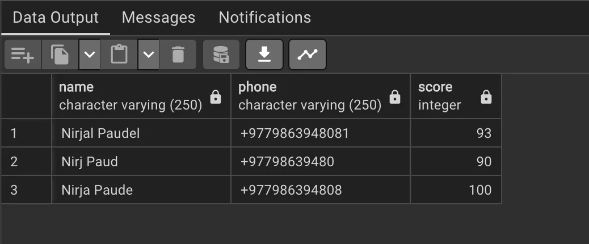

<aside>
📌 **TLDR** We can utilize the temporary tables in SQL to quickly ingest data to use it later
</aside>

In PostgreSQL, a temporary table is a table that exists only during a database session. It is created and used within a single database session and is automatically dropped at the end of the session.

[Read more here](https://www.postgresqltutorial.com/postgresql-tutorial/postgresql-temporary-table/#:~:text=Intermediate%20storage%3A%20Temporary%20tables%20can,for%20storing%20the%20partial%20results)

## Using a temporary table

---


To create a temporary table, we can use `CREATE TEMPORARY TABLE` statement:

```sql
CREATE TEMPORARY TABLE table_name(
   column1 datatype(size) constraint,
   column1 datatype(size) constraint,
   ...,
   table_constraints
);
```

Operations like inserting, updating and deleting data queries will be the similar to that of a normal table.

```sql
CREATE TEMPORARY TABLE IF NOT EXISTS temp_student(
	name VARCHAR(250),
	phone VARCHAR(250),
	score INT
);

DELETE FROM temp_student;

INSERT INTO temp_student(name, phone, score)
VALUES
('Nirjal Paudel', '+9779863948081', 93),
('Nirja Paude', '+977986394808', 94),
('Nirj Paud', '+97798639480', 90);

UPDATE temp_student
SET score = 100
WHERE score::int > 93;

SELECT * FROM temp_student;
```



As you can see above we created a temp table, deleted every record from it just in case if it was created later. Inserted few values there and updated the score there and shown all the records there.

Ok, this looks good conceptually but what can be the pros and cons of using temporary tables. Lets discuss that.

## Personal Story Here

---

For me temporary tables are mostly used when I have to perform some bulk updates. Say updating stock changes from 3rd party to our backend. Most of the times I have seen that performing a bulk insert is much more performant than performing update one by one.

On the application level ORM really doesn’t  really provide us with bulk update method like bulk insert methods. So there was only one method to  perform the above like query

```python
 # dict of item_id and stock
 # 1, 2
 # 2, 0 and so on
item_stock_dict = {}
items = Items.objects.all()
for item in items:
	new_stock = item_stock_dict.get(item.id)
	if new_stock is not None:
		item.stock = new_stock
		item.save()
```

> In the worst case the code above will call save() method n times, here n = number of items in the database.
>

We had around 200k items in our database and 200k  network calls were certainly not helping me. So was I set to reduce the networks calls as quick as possible and I tried to reduce the network call to around as minimum as possible, ideally down to 1.

<aside>
⚠️ There might be some overhead due to ORM’s complex way of handling operations here. As save() method doesn’t only translate to `UPDATE` query

</aside>

## Some uses of Temporary tables in SQL

---

1. **Intermediate storage**: This is how I mostly use temporary tables as a intermediate storage of data. In a bare temporary table, without any index, I fill up all the entries from rest api and then I update the permanent table values using this table.
2. **Performance optimization:** I am a big fan of using a temporary table to cache a calculated value. I prefer this when I am to save redis pricing. TEMPORARY TABLES ALSO SUPPORT
3. **Saving intermediate values:** We can always store values like total items sold per day, per month etc using temporary tables and use it later to add it in a permanent tables or again use it further processing.
4. **Ingesting big values:** I have been using temporary tables to ingest API values into smaller subset of tables sharing same structure like of another table. We will see how I used this method to solve my problem.

## So, How I solved my problem using temporary tables

---

1. First of all I created a temporary table of item and stock. I looped through all the items and performed a bulk updates of items into the temporary table. For 200k, I used a insert chunk size of 10k items at a time.
2. Afterwards, I performed an UPDATE query by using the temporary tables.

```python
from django.core.management.base import BaseCommand
from django.db import connection
from inventory.models import Item, Stock

class Command(BaseCommand):
    help = 'Perform bulk update using temporary tables and raw SQL'

    def handle(self, *args, **kwargs):
        self.create_temp_table()
        self.insert_into_temp_table()
        self.update_from_temp_table()

    def create_temp_table(self):
        with connection.cursor() as cursor:
            cursor.execute("""
                CREATE TEMPORARY TABLE temp_stock (
                    item_id INTEGER,
                    quantity INTEGER
                )
            """)

    def insert_into_temp_table(self):
        items = Item.objects.all()
        chunk_size = 10000
        temp_data = []

        for item in items:
            temp_data.append((item.id, item.net_stock))
            if len(temp_data) >= chunk_size:
                self.bulk_insert(temp_data)
                temp_data = []

        if temp_data:
            self.bulk_insert(temp_data)

    def bulk_insert(self, temp_data):
        # I get temp_data from rest api
        # around 55k items and new stock
        # { item_id: 1212, stock: 1} from rest api as an array
        with connection.cursor() as cursor:
            insert_query = """
                INSERT INTO temp_stock (item_id, quantity)
                VALUES %s
            """
            insert_values = ','.join(
                cursor.mogrify("(%s, %s)", row).decode('utf-8')
                for row in temp_data
            )
            cursor.execute(insert_query % insert_values)

    def update_from_temp_table(self):
        with connection.cursor() as cursor:
            cursor.execute("""
                UPDATE stock
                SET quantity = temp_stock.quantity
                FROM temp_stock
                WHERE stock.item_id = temp_stock.item_id
            """)
```

## Further improvement

---

1. Maybe I can utilize redis to store stock information and retrieve it from there everytime using `@property` method in Item model. This will highly improve update ETA but processing based upon stock will have to move away from db bringing overhead in system’s level
2. Maybe I can remove the temporary table at all and update all the data at once using transactions and remove this update step at all from the process. But I think JOIN will be problematic here. Maybe hash based joins will help.

Why not follow this blog by subscribing to the newsletter and connecting with me across my social medias.

## About me

I love to create bugs in development so that there are no bugs in production.

[Github](https://github.com/n1rjal)

[Linkedin](https://www.linkedin.com/in/nirjalpaudel)

[Blogging](https://n1cs.tech)

[Twitter](https://twitter.com/n1rjal)
