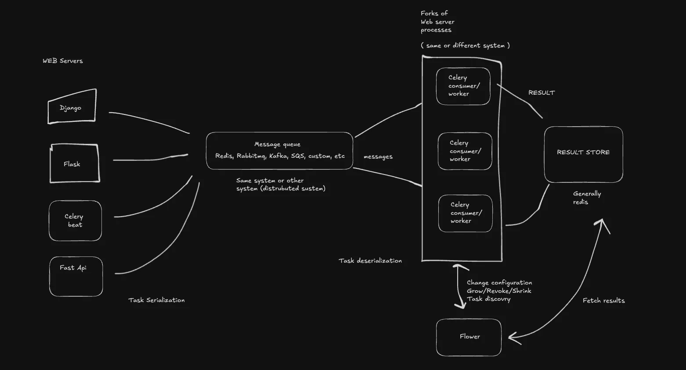

By the end of this article, you will be able to understand all the details about celery and I am also sure that you will be curious about celery. If you’re a complete beginner to celery and seeing this article, kudos to you. If you are a celery veteran lets discuss. Here are some things you will understand by the end.



## What is celery

### According to celery

Task queues are used as a mechanism to distribute work across threads or machines. A task queue's input is a unit of work, called a task, dedicated worker processes then constantly monitor the queue for new work to perform. Celery communicates via messages, usually using a broker to mediate between clients and workers. To initiate a task a client puts a message on the queue, the broker then delivers the message to a worker.

A Celery system can consist of multiple workers and brokers, giving way to high availability and horizontal scaling. Celery is written in Python, but the protocol can be implemented in any language.

### According to Me

Before making you understand what celery is. I will need to make you understand what message queues are. Celery is a system that lets you set up and leverage background task processing. Here is an overall background task processing.

For your normal every day application, an example of background processing can be seen when you upload a photo in instagram story. The picture will be in uploading in background. While you can use your application and after a while it will be uploaded. Your upload may be not successful if there is no internet.

The same concept of some other thing doing your work is called message queues. In python, celery is one of the many tools that helps us to use message queue.

## Why use Celery

Here are few simple reasons to use celery

1. **Task Queue Management**: Celery helps manage background jobs, offloading long-running tasks (e.g., sending emails, processing images) from your web server to avoid delays in user responses.
2. **Asynchronous Processing**: Celery can execute tasks asynchronously, meaning they run in the background without blocking the main application.
3. **Distributed Task Execution**: It can scale horizontally across multiple workers, making it suitable for handling large volumes of tasks.
4. **Scheduled Jobs**: You can use Celery to schedule periodic tasks, like cleaning up databases or sending reminders.
5. **Reliability**: Celery ensures tasks are reliably executed, retrying on failure and providing monitoring options.

## Understanding the basic architecture of celery


In celery, there are three different components, three components are listed below. We will move from right to left so that you will understand the components better

### Transport

Celery transport are the things that are responsible for storing the tasks arguments, its states. It will also track various task related data like name, uuid, runtime, no of retries etc.

Some of the most popular celery transport are

- Redis
- RabbitMQ
- Kafka
- [others are listed in celery docs](https://github.com/celery/celery?tab=readme-ov-file#transports-and-backends)

### Task Serialization/Deserialization

**Task serialization and deserialization** in Celery refer to the processes of converting tasks to and from a format that can be transmitted over a broker and executed by workers. These processes are crucial for ensuring that tasks can be reliably sent, stored, and processed in a distributed system.

The various task serialization formats in celery are:

1. **JSON**: A widely-used, human-readable format. Suitable for most tasks but may not support complex Python objects. I suggest you use JSON.
2. **Pickle**: A Python-specific format that supports a broader range of Python objects but is less portable and can have security implications if untrusted data is deserialized.
3. **YAML**: An alternative to JSON with more readable formatting, but less commonly used for task serialization.
4. **Msgpack**: A binary format that is efficient in both space and time.

### Consumer/Worker

Consumer/Workers are python functions that will take input and output. It will tasks input from transport and process it, processing a task means running the function for the parameters provided. The task of consumer stops when the given function finishes execution or fails doing so.

If the task is failed. Celery worker returns the message back to the transport. Transport increases its retries count and the worker will run again.

```python
from celery import shared_task

@shared_task
def adder(num1, num2):
	sleep(2)
	return num1 + num2
```

### Producer

Producer calls celery tasks with argument supplied. For celery worker to receive the task called. The called task must be wrapped by the `@shared_task` decorator. Producer can be anything from views, models, celery beats, etc. It will called the task declared using .delay() method on it

```python
# In some other file

from .tasks import adder

def run():
	res = adder.delay(num1=12, num2=13)
	return res

run()
```

## Celery concurrency

### Pre-fork(multiprocessing):

The default model, pre-fork, is well-suited for many scenarios and generally recommended for most users. This is ideal for most use cases.

### eventlet and gevent

Designed for IO-bound tasks, these models use greenlets for high concurrency. Note that certain features, like soft_timeout, are not available in these modes. These have detailed documentation pages linked below.

> switching to another mode from pre-fork will silently disable certain features like soft_timeout and max_tasks_per_child.
>

### Solo

Executes tasks sequentially in the main thread. I think this approach is useful when you are doing simple and lightweight tasks. You can use this to debug as this model doesn’t have parallelism and is highly predictable as the ordering of messages are maintained. Can’t be used for large scale.

### Threads

Utilizes threading for concurrency, available if the concurrent.futures module is present. Uses threads instead of processes. Task that are I/O bound like involves waiting for network calls, reading/writing files, or interacting with external API will benefit highly from this mode of concurrency.

They share the memory and the risk of deadlock and race conditions may be possible. GIL can create further problem when using this method.

### Custom

Enables specifying a custom worker pool implementation through environment variables.

## Celery Limits
> Soft timelimit comes before hard time limit

### Soft Time Limit

In Celery, the **soft time limit** refers to the maximum time (in seconds) a task is allowed to run before it is interrupted. When the soft time limit is reached, Celery raises a `SoftTimeLimitExceeded` exception, which allows the task to handle the situation gracefully by catching the exception and performing any necessary cleanup before it exits.

### Hard time limit

In Celery, the **hard time limit** is the maximum time (in seconds) a task is allowed to run before it is forcefully terminated. Unlike the **soft time limit**, which raises an exception that the task can catch and handle, the hard time limit forcefully kills the task if it exceeds the specified time, without allowing any additional processing or cleanup.

It’s done using `SIGKILL` or `SIGTERM`

### Scenario

Suppose you are processing 120 1GB videos and  `SoftTimeLimitExceeded` exception is thrown at around 80th video. Then you will need to cleanup the process. Here cleaning up may refer to uploading the processed video.

Assumption: Let’s say you ignore the exception and then hard time limit is raised. You task will be killed by OS. All 80GB videos could be lost.

## Celery Task Configuration

Celery task configuration encapsulates various settings which are applied to a particular consumers. It determines things like maximum retries, back_off, soft and hard timeout, etc

Here is how you can assign task configuration. I am looking this from the celery source code.

[https://github.dev/celery/celery/blob/main/celery/app/task.py](https://github.dev/celery/celery/blob/main/celery/app/task.py)

| Task Configuration | Description | Default Value | Notes |
| --- | --- | --- | --- |
| max_retries | Maximum number of retries before giving up | 3 | If set to None, it will never stop retrying |
| default_retry_delay | Default time in seconds before a retry | 180 (3 minutes) | Determines wait time between retries |
| rate_limit | Rate limit for this task type | None (no rate limit) | Examples: '100/s', '100/m', '100/h' |
| ignore_result | If enabled, worker won't store task state and return values | None | Defaults to task_ignore_result setting |
| time_limit | Hard time limit for task execution | None | Defaults to task_time_limit setting |
| serializer | Serializer that will be used | json | json, pickle |
| soft_time_limit | Refer to time limits | :setting:`task_soft_time_limit` |  |

Task configuration can be passed as an argument for `@shared_task` one by one or by using a children of Task class of celery

### Shared task example

This is pretty simple to understand and I don’t suggest you using this, as this doesn’t follow DRY principles

```python
from celery import shared_task
from celery.exceptions import SoftTimeLimitExceeded

@shared_task(
    max_retries=3,                     # Maximum retries
    default_retry_delay=180,            # Default retry delay (in seconds)
    rate_limit=None,                    # No rate limit
    ignore_result=False,                # Store task state and result
    time_limit=None,                    # No hard time limit
    soft_time_limit=None,               # No soft time limit
    serializer='json'                   # Use JSON for serialization
)
def example_shared_task(*args, **kwargs):
    try:
        # Task logic here
        print(f"Processing task with args: {args} and kwargs: {kwargs}")
        # Simulate long processing task
    except SoftTimeLimitExceeded:
        print("Task exceeded the soft time limit")
        # Handle cleanup if necessary
```

### Class Based Task Example

Unlike Shared task based example, this promotes DRY. I use this and I too suggest you use this.

Here is how class based templated tasks are used with celery in my [**djate Django template](https://github.com/n1rjal/djate/blob/main/core/celery.py).** You can start using this template for your test use.

```python
class BaseTaskWithRetry(Task):
    autoretry_for = (Exception,)
    retry_kwargs = {"max_retries": 5}
    retry_backoff = True
    retry_backoff_max = 60 * 5  # 5 minutes
    retuy_jitter = True

    def on_failure(self, exc, task_id, args, kwargs, einfo):
        super().on_failure(exc, task_id, args, kwargs, einfo)
        self.retry(exc=exc, countdown=60 * 5)

class BaseFor10HoursTask(Task):
    autoretry_for = (Exception,)
    retry_kwargs = {"max_retries": 10}
    retry_backoff = True
    retry_backoff_max = 60 * 60 * 10  # 10 hours
    retuy_jitter = True

    def on_failure(self, exc, task_id, args, kwargs, einfo):
        super().on_failure(exc, task_id, args, kwargs, einfo)
        self.retry(exc=exc, countdown=60 * 60 * 10)

class BaseFor24HoursTask(Task):
    autoretry_for = (Exception,)
    retry_kwargs = {"max_retries": 60}
    retry_backoff = True
    retry_backoff_max = 60 * 60 * 24  # 24 hours
    retuy_jitter = True

    def on_failure(self, exc, task_id, args, kwargs, einfo):
        super().on_failure(exc, task_id, args, kwargs, einfo)
        self.retry(exc=exc, countdown=60 * 60 * 24)


```

Then you can use these tasks as a base for shared_task

```python
from celery import shared_task
import time

from core.celery import BaseFor10HoursTask

@shared_task(base=BaseFor10HoursTask)
def add_record_for_calculation(n1, n2, res):
    time.sleep(4)
    return f"Calculation for {n1} and {n2} = {res}"
```

## Other celery components

There are various components that are in used with celery. Some components that are used with celery are as follow.

### Celery beat

Celery beat is a scheduler that schedules tasks at a regular interval, which are then executed by available worker nodes in the current celery setup. It’s used to periodically schedule tasks like a cron job but within celery environment.

You will need to install celery beat. A newer blog on celery beat is on the way.

```powershell
pip install celery[redis]
```

In a nutshell, adding this will be it

```powershell
# tasks.py
from celery import Celery
from celery.schedules import crontab

app = Celery('my_app')

@app.task
def periodic_task():
    print("Running periodic task!")

app.conf.beat_schedule = {
    'run-every-hour': {
        'task': 'periodic_task',
        'schedule': crontab(minute=0, hour='*'),  # Executes every hour
    },
}
```

Adding beat after the project name is enough to run celery worker and beat at the same time.

```powershell
celery -A your_project beat --loglevel=info
```

### Result backend

Result backend is a place where all the tasks result that has been executed. It stores various information about the task. The various information are as follow:

1. Task result: If you need to access the return value of a task after it has been executed.
2. Task state: It records task states like PENDING, STARTED, SUCCESS, FAILURE, RETRY etc.
3. Task chaining information: Information that what is the root task of the particular task, parent of the particular task, etc can also be seen

Some of the common celery result backend are as follow

1. Memory: As name suggest it store information in memory
2. Redis: Stores the result in redis
3. RabbitMQ
4. Django ORM/Database
5. [Others: Learn more here](https://docs.celeryq.dev/en/stable/getting-started/backends-and-brokers/index.html)

## Celery Monitoring with flower

Flower is a python [Ternado web framework based](https://www.tornadoweb.org/en/stable/) web interface that makes it easy to view information about celery and its information. Information about results can be viewed in flower. Flower can be run in various ways.

I suggest you run using [Mehr/Flower](https://hub.docker.com/r/mher/flower) docker image. It also provides remote control over celery workers. Here is a simple way to setup celery flower in docker compose. I use flower only in production environment.

> Flower can be integrated with Grafana and Prometheus as well
>

See this docker-compose.yml file

```yaml
services:
  app:
    container_name: djate_app
    restart: unless-stopped
    build:
      context: .
    volumes:
      - djate_data:/app/
      - .:/app
    depends_on:
      - redis
      - worker_beat
    ports:
      - "8000:8000"
    env_file: .env
    networks:
      - djate_net

  worker_beat:
    restart: unless-stopped
    build:
      context: .
    command: ["/bin/sh", "-c", "celery -A core  worker -l info --concurrency=1"]
    env_file: .env
    volumes:
      - djate_data:/app/
      - .:/app
    networks:
      - djate_net

  redis:
    container_name: djate_syncer_redis
    image: redis:alpine
    restart: always
    volumes:
      - djate_data:/app/
    networks:
      - djate_net

  flower:
    image: mher/flower
    command: ['celery', '--broker=redis://redis:6379', 'flower', '--port=5555', "--basic-auth=admin:pswd"]
    ports:
      - 7777:5555
    env_file: .env
    depends_on:
      - redis
    networks:
      - djate_net

volumes:
  djate_data:
    driver: local

networks:
  djate_net:
    driver: bridge
    name: djate_net

```

Now lets zoom into flower service and inspect the command and its various arguments passed to it.

```yaml

services:
  flower:
    image: mher/flower
    command: ['celery', '--broker=redis://redis:6379', 'flower', '--port=5555', "--basic-auth=admin:pswd"]
    ports:
      - 7777:5555
    env_file: .env
    depends_on:
      - redis
    networks:
      - djate_net

```

The various arguments are:

`--broker-url`  redis://redis:6379

See how both flower command and celery worker commands shares the same broker

`—port 5555`

Running it on port 5555 internally. But below you can see that I have exposed it on 7777 port of the system

`—basic-auth`

From the various auth provided by flower. Like google OAuth, Github OAuth, Okta OAuth, Gitlab OAuth and basic auth, I have used basic auth with admin and password provided as above. ***Make sure you change this when you use my template.***

## Conclusion

In this article, you went from understanding basics of celery to the very advanced concepts of celery. I would like you to use this template repository, [https://github.com/n1rjal/djate](https://github.com/n1rjal/djate), and use it to test the knowledge and a star(🌟) to the repository won’t be bad. Next time we will try to do something more complex in celery. Well, until then good bye.

---

Follow me on linkedin. I like to post tech related stuff.

[https://www.linkedin.com/in/nirjalpaudel/](https://www.linkedin.com/in/nirjalpaudel/)
