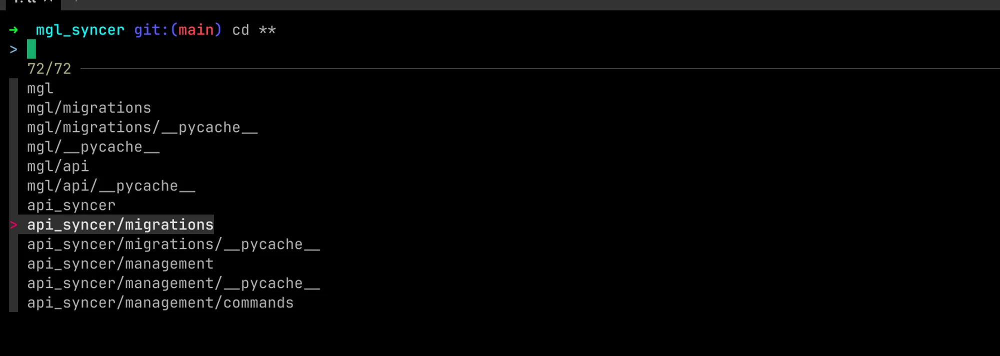

---
title: I have been optimizing my development productivity
date: '2024-06-23T08:57:45.903Z'
categories: []
keywords: ['productivity', 'nirjal paudel', 'tmux', 'developer', 'developer productivity']
slug: /@nirjalpaudel54312/i-have-been-optimizing-my-development-productivity
categories:
- productivity
tags:
- habit
- productivity
- vim
- tmux
- bash
summary: 'How I enhanced developer productivity with personal tools, bash scripts, aliases and organizational practices'
params:
  author: Nirjal Paudel
  images:
  - og_dev_prod.png
sitemap:
  changeFreq: ""
  disable: false
  filename: sitemap.xml
  priority: 1
---


As a developer, we write many code and most of the times, we as a developer all do is repeatedly do some things. Coding is mostly copying things, I mean apart from the logical part where you need to put some mental energy into coding. We mostly write some piece of code which are always repeated. I have been finding the patterns like this in my workflow and as a big fan of automation. I knew that some kind of automation can be done to make this process faster and efficient.

## What is developer productivity ?

### According to ChatGPT

> Developer productivity refers to the efficiency and effectiveness with which software developers can produce high-quality software and achieve project goals. It encompasses various aspects including coding speed, code quality, problem-solving abilities, and the overall impact of a developer's work on the project's success
>

### According to Myself

Developers productivity is something that makes my process of coding, working and making software more fast and efficient. I have been following some extreme and some easy ways to make the code cycle more effective.

Here are some of the practices that I have been following to make myself efficient.

## Personal Productivity

This part of the blog involves most of the steps/tools that I use to make my coding process a bit easier. Some of the steps involve changing the text editor I use, the way I navigate the codebase and the way little tools that I use to automate my process.

### Using Neovim and Tmux

I have been using neovim to make my coding process really efficient and you are a VScode user 🤣 (pun intended). Neovim has many features like registers, macros, and a effective way to navigate the codebase.

Tmux is a terminal multiplexer. Learn more about Tmux here. It has a huge list of plugin that can be plugged into your tmux config and it makes it easier for you to work on multiple terminal session at once.


Imagine instead of opening folder everytime you switch project you search by name of the folder and open  it right away. Its <Ctrl+A>f button away in my tmux config. In the above photo, all of them are like separate vscode folders


Here is what a typical development would look like in my terminal.

I will have one part of terminal (also called **tmux panes**) one runs neovim, one runs server and the other one is for interactive REPL session. Jumping between them is as easy as pressing 2 buttons.

### Command line Aliases

Aliases can be created by using bashrc or .zshrc files or any files if you source if it. Aliases makes it easy to reference the commands. Here are some of the command line alisases you can use to make your development process one bit easier.

Using commands like these, I can make my process I bit easier. Here is an example to show you example of how I can use dc to start docker compose

```bash
# for git
alias g="git"
alias gf="git-flow"

# for net
alias op="netstat -vanp tcp"

alias ll="ls -al"

# for docker
alias d="docker"
alias dc="docker compose"

alias mkcd='mkdir -p "$@" && cd "$@"'

# for django
alias pm='python3 manage.py'
alias pmr='python3 manage.py runserver'
alias pmm='python3 manage.py makemigrations && python3 manage.py migrate'
alias pkill='ps aux | grep -v grep | grep $1 | awk '{print $2}' | xargs kill -9'

# Copy current path to clipboard
alias p='pwd | pbcopy'

# Json to csv
alias j2c='in2csv -f=json | csvlook'

# for tmux
alias tt='tmux attach -t'
alias tns='tmux new -s'
alias tks='tmux kill-session -t'
alias tls='tmux ls'

# for nestjs
alias ddw="NODE_ENV=\"development\" pnpm start:debug"
alias pdw="NODE_ENV=\"production\" pnpm start:debug"

alias sshserv="ssh -i ~/sshkey.pem ubuntu@<ip>"
```


### Command Line Functions

Command line functions are functions that you declare in your .bashrc or .zshrc files. I have some functions that helps me perform some tasks easily. Here are some of the functions that I have build to make my process that bit easier.

```bash
function sdrr () {
      open /Applications/Docker.app
      sleep 20
      d start red
      d start rmq
}

function sd () {
      open /Applications/Docker.app
}

# Add Commit push
function acp() {
       git add .;
       git commit -m "$1"
       # Calulate Current Branch
       cb=$(git branch | grep '[*]' | sed 's/* //g');
       # Push into server;
       git push origin $cb;
}

function gpl(){
       cb=$(git branch | grep '[*]' | sed 's/* //g');
       git pull origin $cb;
}

jj() {
    if [ "$#" -ne 1 ]; then
        echo "Usage: jj <FullJavaFileName>"
        return 1
    fi

    local filename="$1"
    local dirName=$(dirname "${filename}")
    local className=$(basename "${filename}" .java)

    # Compile the Java file
    javac "${filename}"
    if [ $? -ne 0 ]; then
        echo "Compilation failed."
        return 1
    fi

    # Change to the directory where the class file is located
    pushd "${dirName}" > /dev/null

    # Run the compiled Java class
    java "${className}"

    # Return to the original directory
    popd > /dev/null
}
```

> Here is an example below of using the command line functions. The acp function here git add, commit with the given message and then pushing it to the remote( origin )
>


### Command line tools

I have been using some of the command line tools to make it easier to perform some boring to do but important tasks. Here are some of the tools that I use.

**Curl and jq**

Jq is a tools that I allows us to parse JSON content from the command line itself, it works well with curl. Curl is a http client tool mostly comes preinstalled in most linux OS. Here is how I use jq and curl to navigate the response of the rest api in the terminal. Here is what I will see the response.

```bash
curl https://raw.githubusercontent.com/n1rjal/next-portfolio-in-json/main/public/entries/next-portfolio.nirjalpaudel.com.np.json | jq '.socials'
```


**Fzf**

Fzf is a fuzzy finder tool that makes it easier to fuzzy find content inside terminal. It works well in terminal for finding files, folders, etc. A simple UI with search input will popup on clicking TAB in my terminals

```bash
cd ** # and then I press TAB
```



## Organizational Productivity

Organization productivity is generally achieved by following various cultural and decisions that makes it easier to integrate new people and makes it easier to implement high quality code.

### Organizational template repository

Organizational templates are those templates that my organization uses when starting a new project. It has some of the dot files, that we use like `pretteric.json` `eslintric.json` and all the `docker-compose.yml` files that makes it easier to setup the required infrastructure for the project and all the packages that may or will be used also comes preinstalled here.

Here are two public repository that we use.

[https://github.com/n1rjal/djate](https://github.com/n1rjal/djate)

[https://github.com/n1rjal/interview-template](https://github.com/n1rjal/interview-template)

### Pre-commit hooks

Pre-commit hooks are those hooks that will run before commit ( so called pre-commit ). There are various pre commit hooks that we use. Generally in Nestjs code base there is a pre-commit hook that will do the prettier formatting and also eslint standard checks and also unit tests, if there are any.

### Github actions

Github actions are some actions/code that will run when a specific actions happens in your GitHub repository. Some of the actions that occurs in github repository are

1. Push
2. Pull request
3. Manual dispatch
4. Periodic dispatch via cron job

When events like this happen, some action will be triggered. I cannot show the code of Github action used in my organization but here is one I use to re-trigger the blog site you are seeing right now.

```yaml
name: Update random blogs

on:
  schedule:
    - cron: '0 */6 * * *'  # Schedule to run every 6 hours
  workflow_dispatch:

jobs:
  curl-rest:
    runs-on: ubuntu-latest

    steps:
      - name: Perform REST request using curl
        run: curl -d {} ${{ secrets.PAGES_WEBHOOK_URL }}
        env:
          PAGES_WEBHOOK_URL: ${{ secrets.PAGES_WEBHOOK_URL }}
```

We also use one app on our organization that will receive notifications on successful execution of organizational process and once we don’t get regular notifications. Then we come to realize that something is wrong and we are fucked probably via a bug or some random breakage in code. I will publish more on this later sometimes.
>

## Conclusion

Being productive has many angles and I only talked about the development part here. Offcourse there are other types of productivity as well. Lets say, cutting out disturbances while working, etc. There are enough videos out there on this topic.

> I will always try to make my process more effective. So, if I missed something lets connect on linkedin at [https://www.linkedin.com/in/nirjalpaudel](https://www.linkedin.com/in/nirjalpaudel)
>
