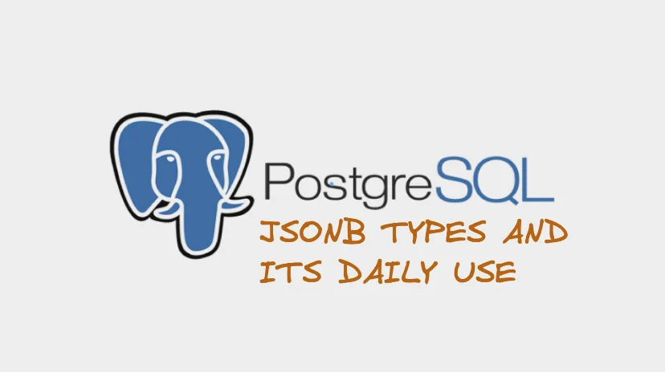

Postgres is a SQL database. It is powerful and I have written various other articles in postgres and its optimization.


After covering topics like temporary tables, which I used in production, I am yet again covering another trick that I have utilized to make the database query efficient.



## What is JSONB

JSON data types are for storing JSON (JavaScript Object Notation) data, as specified in [**RFC 7159**](https://datatracker.ietf.org/doc/html/rfc7159). Such data can also be stored as `text`, but the JSON data types have the advantage of enforcing that each stored value is valid according to the JSON rules. There are also assorted JSON-specific functions and operators available for data stored in these data types.

But Postgres has 2 ways of storing json

1. json
2. jsonb

Both json and jsonb are quite similar as they accept the same value. Jsonb input function is stricter. [Learn more about it here.](https://www.postgresql.org/docs/current/datatype-json.html)

## JSONB operations

```sql
-- Simple scalar/primitive values contain only the identical value:
SELECT '"foo"'::jsonb @> '"foo"'::jsonb;

-- The array on the right side is contained within the one on the left:
SELECT '[1, 2, 3]'::jsonb @> '[1, 3]'::jsonb;

-- Order of array elements is not significant, so this is also true:
SELECT '[1, 2, 3]'::jsonb @> '[3, 1]'::jsonb;

-- Duplicate array elements don't matter either:
SELECT '[1, 2, 3]'::jsonb @> '[1, 2, 2]'::jsonb;

-- The object with a single pair on the right side is contained
-- within the object on the left side:
SELECT '{"product": "PostgreSQL", "version": 9.4, "jsonb": true}'::jsonb @> '{"version": 9.4}'::jsonb;

-- The array on the right side is not considered contained within the
-- array on the left, even though a similar array is nested within it:
SELECT '[1, 2, [1, 3]]'::jsonb @> '[1, 3]'::jsonb;  -- yields false

-- But with a layer of nesting, it is contained:
SELECT '[1, 2, [1, 3]]'::jsonb @> '[[1, 3]]'::jsonb;

-- Similarly, containment is not reported here:
SELECT '{"foo": {"bar": "baz"}}'::jsonb @> '{"bar": "baz"}'::jsonb;  -- yields false

-- A top-level key and an empty object is contained:
SELECT '{"foo": {"bar": "baz"}}'::jsonb @> '{"foo": {}}'::jsonb;
```

## Jsonb indexing

We will be using GIN indexes to efficiently search for keys or key/value pairs occuring within a large number of jsonb documents. [Learn more about it here](https://www.postgresql.org/docs/current/datatype-json.html#jsonb-indexing)



## Why use JSONB documents

JSON is document mostly are anti pattern according to the rules of normalization and must not be done if you are pretty sure about what are you trying to achieve with it. There must be a maximum cardinality in place as well if you are trying to mimic one to many or many to many relationship with it. Let me write a simple pseudocode to explain the logic.

1. Mostly JSONB documents are used to used less joins
2. Using it as data dump

### Netflix account and profiles

I believe that you are pretty familiar with this concept. You have an account table and profiles table. Since at Netflix scale there will be million accounts and millions of profiles. So, performance will suffer if you do simple LEFT join. So, we have to change our table to use user profiles as JSONB.

Here is what the new table would look like


> Now in application we can manage profiles using array methods
>


This is how profiles will look like.

```json
{
   "email":"nirjalpaudel54312@gmail.com",
   "password":"hasahsasasas",
   "last_login":"2023-12-28T19:20:20:0000Z",
   "payment_valid_till":"2024-01-28T19:20:20:0000Z",
   "profiles":[
      {
         "profile_name":"Nirjal",
         "created_at":"2022-12-28T19:20:20:0000Z"
      },
      {
         "profile_name":"Kids",
         "created_at":"2023-06-12T01:02:20:000Z"
      }
   ]
}
```

**Pros**

- Faster profile access
- No joins involved

**Cons**

- If used for Many to many tables, there can be a lot of duplicates
- If JSONB column is too large, retrieving the row will be very time consuming.

### Use as data dump

I  am unsure what to name this example about. But hear me out. Lets say you order an item in 2020 and now its 2024. And your order tables look like this.


Here we have referenced, item in order_item and using price from item table to put in order item.

Now, let me introduce a word that whole world is scared of **INFLATION.** Inflation has increased the rice per kg of item from NPR 20 in 2020 to NPR 50 in 2024.

Now there is consequence of inflation not only in your life but in your database as well. Here is an example. As price of rice has changed, your data will be inconsistent. Now in 2020, the order will be like this.


A simple order invoice in 2020 will look like this in 2020 as price have changed in 2024, the order invoice would change as


How can can a completed order change change with time. Here are two approaches to work with this.

1. Use Event sourcing pattern, will talk about it later
2. Use dumped data

Using dumped data is a concept which I mostly use. So, lets  introduce a column called order_data which is a dumped json data of order item and item. And it will not change as it is a jsonb table.

> No references of foreign row will be used in the dumped data.
>


Example of order with the dumped order data is given below

```json
{
    "order_id": 12345,
    "user_id": 67890,
    "status": "pending",
    "created_at": "2024-06-26T10:00:00Z",
    "order_data": "Sample data",
    "order_items": [
      {
        "order_item_id": 1,
        "item_id": 101,
        "quantity": 2,
        "item": {
          "item_id": 101,
          "item_name": "Item A",
          "unit_price": 9.99
        }
      },
      {
        "order_item_id": 2,
        "item_id": 102,
        "quantity": 1,
        "item": {
          "item_id": 102,
          "item_name": "Item B",
          "unit_price": 19.99
        }
      }
    ]
  }
```

**Pros**

- Independent on foreign data
- Less joins

**Cons**

- Huge data duplication

> I have once optimized database access from 6s to 600ms. I had used JSONB heavily there. Lesser joins and dumped data was the pattern which I used to achieve.
>

## Conclusion

In this blog, I talked about JSONB data type and two of the patterns which I used in database designing and system designing. Everything in computer science is a two edged sword. The tips I provided here can be good and bad depending upon the condition.

So, if you have any better patterns for JSONB in SQL or for any of the patterns mentioned here. Feel free to comment down below. Until then, follow me on my socials. Peace out ✌️
