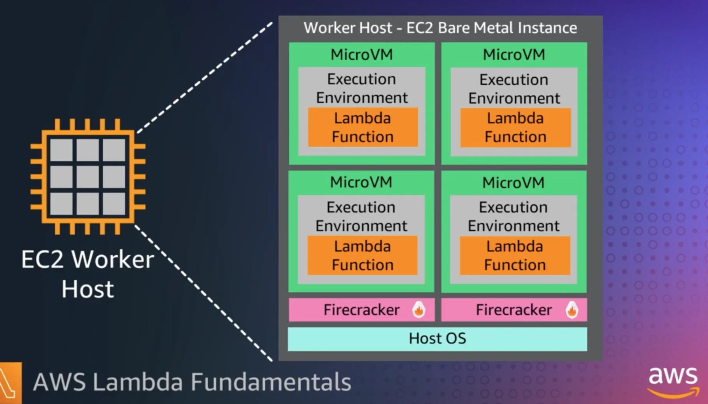

# Lambda

Lambda can be deployed using .zip archive function container image with OCI or docker container image

<aside>
📌 We can use reserved concurrency to limit the number of maximum concurrent invocations for your function.

---

**Function’s Maximum request rate per second (RPS)**

`10 * maximum reserved concurrency`

> Reserved concurrency = 0 means, function is deactivated
>

</aside>

<aside>
⚠️ Use AWS SAM for making lambda

Can find paterns here.

[Serverless Land](https://serverlessland.com/patterns)

</aside>



<aside>
⚠️ **Lifecycle**


</aside>

<aside>
📌 Design Best Practices

- Separate business logic from handler method
- Single purpose function. Rather use 3 seperate functions instead of 3 things in one function
- Reduce dependency size ~ dynamoDB instead of aws-sdk
- Each function must be stateless, store state in DDB or S3, EFS
</aside>


<aside>
📌 Security

**IAM resource policy:** Think what has access to trigger.

**IAM execution role:** Controls what the function can do like cloud watch logs, crud, etc

SAM only allows permissions of resources mentioned in the template.

</aside>


<aside>
📌 Billing

- Pay as you go, Pay for value
- Based on number of requests / number of invokes
- Duration: Invocation time x allocated memory (GB) - 120 Meg to 10GB
- Increase in mem size ~ Increase in cpu used
- x86 or x64 → 34% better price performance using Gravitonx64


</aside>


<aside>
📌 Lambda Networking


- Internet access when attached to a VPC

    By default, Lambda functions have access to the public internet. When You attach your function to a VPC, it can only access resources available within that VPC. If you want internet access in VPC enable internet access that for your VPC

</aside>

### Lambda Scaling

---

**Function’s Maximum request rate per second (RPS)**

`10 * maximum reserved concurrency`

---

### Understanding ad visualizing concurrency

Lambda invokes your function in a secure an isolated environment. Has 2 phases

- Init
- Invoke


<aside>
📌 Actual Init and Invoke durations can vary depending on many factors, such as the runtime you choose and the Lambda function code. The previous diagram isn't meant to represent the exact proportions of Init and Invoke phase durations.

</aside>

### Reusing init environment in consequent environment for concurrency of 1


### Reusing init environment in consequent environment for concurrency of 10


1. **Request 1: Provisions new environment A**
    - **Reasoning**: This is the first request; no execution environment instances are available.
2. **Request 2: Provisions new environment B**
    - **Reasoning**: Existing execution environment instance A is busy.
3. **Request 3: Provisions new environment C**
    - **Reasoning**: Existing execution environment instances A and B are both busy.
4. **Request 4: Provisions new environment D**
    - **Reasoning**: Existing execution environment instances A, B, and C are all busy.
5. **Request 5: Provisions new environment E**
    - **Reasoning**: Existing execution environment instances A, B, C, and D are all busy.
6. **Request 6: Reuses environment A**
    - **Reasoning**: Execution environment instance A has finished processing request 1 and is now available.
7. **Request 7: Reuses environment B**
    - **Reasoning**: Execution environment instance B has finished processing request 2 and is now available.
8. **Request 8: Reuses environment C**
    - **Reasoning**: Execution environment instance C has finished processing request 3 and is now available.
9. **Request 9: Provisions new environment F**
    - **Reasoning**: Existing execution environment instances A, B, C, D, and E are all busy.
10. **Request 10: Reuses environment D**
    - **Reasoning**: Execution environment instance D has finished processing request 4 and is now available.

### **Calculating concurrency for a function**

`Concurrency = (average requests per second) * (average request duration in seconds)`

<aside>
🧠 **TEST YOUR LAMBDA CONCURRENCY KNOWLEDGE**

Suppose you have a function that takes, on average, 200 ms to run. During peak load, you observe 5,000 requests per second. What is the concurrency of your function during peak load?

```markdown
Concurrency = (5,000 requests/second) * (0.2 seconds/request) = 1,000
```

Alternatively, an average function duration of 200 ms means that your function can process 5 requests per second. To handle the 5,000 request per second workload, you need 1,000 execution environment instances. Thus, the concurrency is 1,000:

```
Concurrency = (5,000 requests/second) / (5 requests/second) = 1,000
```

</aside>

<aside>
⚠️ 10 execution environment instances can handle at least 100 request per second, as concurrency * 10

> Because an execution environment can only handle 10 RPS
>

```
Concurrency = (200 requests/second) * (0.05 second/request) = 10
```

But the an execution environment can only handle 10 * concurrent meaning that, it can only handle 100 RPS. Throttling will occur, so we will need to manage 20 concurrency value to manage to handle the load of 200 RPS

</aside>

### **Concurrency control in Lambda**

<aside>
⚠️ At maximum, you will have 1000 concurrent executions across all functions in a region. - **On Demand Basis -  429 if you run out of provisioned concurrency**

</aside>

There are two types of concurrency control in lambda


### Reserved Concurrency control:

1. Max number of concurrent execution unit that you want to allocate
2. No extra charge
3. No other functions can use that concurrency


1. t4 - t5: unreserved functions are throttling ( 200+ / 200 ) independent to others
2. t3-t4: orange is throttling (400+ / 400) independent to others

1. Can’t cap out of control
2. Controlled scaling
3. May not be able to fully utilize system concurrency

### Provisioned Concurrency control

- Done to mitigate cold start latency problems
- Will respond immediately to a request


- t1, immediate invocation due to provisioned concurrency.
- t2, limit reaches 400
    - now uses unreserved concurrency requests
    - Lambda uses unreserved
    - creates executions environment and cold start latencies are experiences
- t3, returns to provisioned capacity
- t4, burst in traffic, uses unreserved concurrency
- t5, full account-region limit is reached and now throttling is experienced

The diagram below is similar and must be done like this in production to limit unprovisoned function to not die.


<aside>
⚠️ When you submit a request to allocate provisioned concurrency, you can't access any of those environments until Lambda completely finishes allocating them. For example, if you request 5,000 provisioned concurrency, none of your requests can use provisioned concurrency until Lambda completely finishes allocating the 5,000 execution environments.

</aside>

<aside>
📌 Lambda Deployments

- Add aliases. Latest is $LATEST
- Alias is a function version pointer


</aside>
