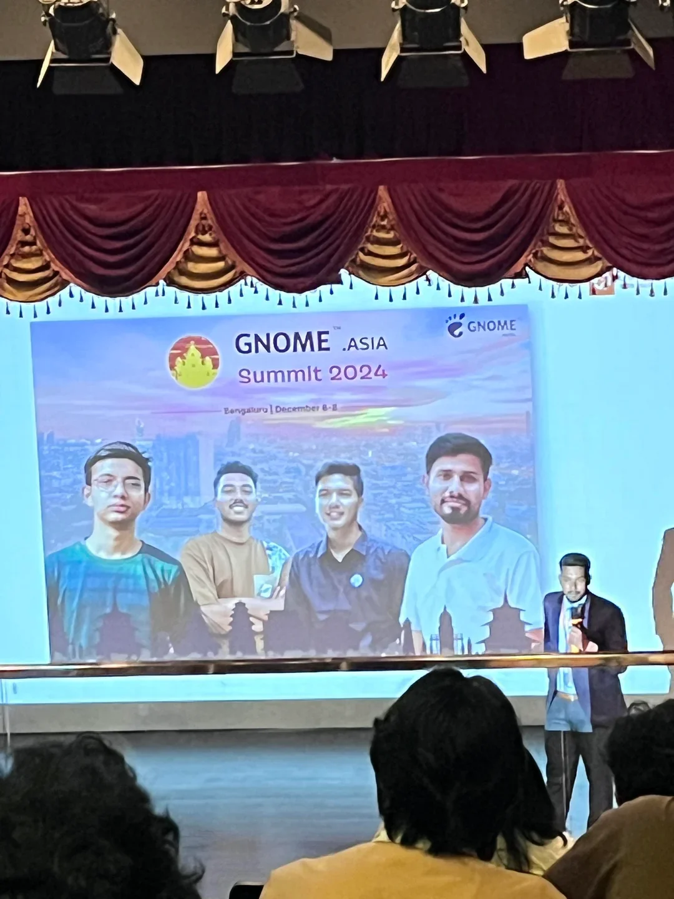
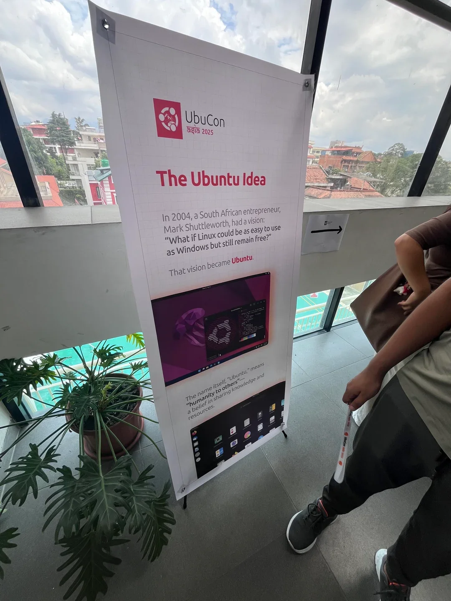
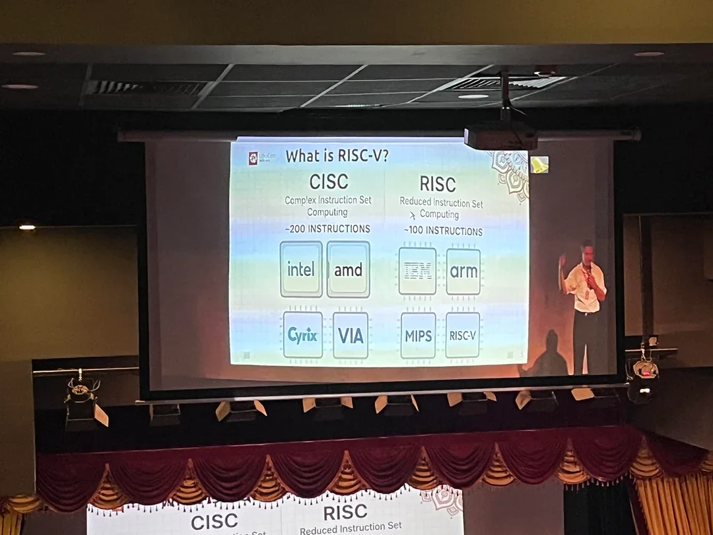

The energy was palpable. The idea, born from a desire to celebrate open source and the Ubuntu community, had blossomed into reality. It wasn’t long ago that GNOME Nepal represented our country at GNOME Asia Summit 2024, and now, here we were, preparing to give back to the community on a grander scale. The bid to host Ubucon 2025 was a unanimous decision among the members of GNOME Nepal, and when our bid was accepted, a feeling of immense honor and responsibility washed over us.

The event was set for August 30, 2025, in our home country, Nepal. While I couldn't be a part of the organizing team after the initial bid due to other commitments, my initial nervousness about attending as just a participant quickly faded. Seeing my friends from GNOME Nepal in action—organizing, managing sponsors, and setting up the venue—was truly inspiring. It was also a rare opportunity to meet some of my online friends in person.

And what a blast it was! I met people from all walks of life and had a chance to discuss a wide range of topics, from personal projects and philosophical ideas to local culture and that special brand of Nepalese sarcasm.

---

## The Crazy People I Met

One of the highlights was the incredible people I got to connect with.

- **Jianfeng Li:** We dove into a deep discussion about LLMs, specifically the differences between local and cloud-based models and the potential for these AI assistants to have memory and remember user preferences.
- **Venkatesh Chaturvedi:** A true "self-hosted god," Venkatesh has created his own personal ecosystem at home. Beyond just a mail server, he runs his own Spotify, search engine, Google Photos, VPN, and DNS servers. I can only imagine how low his electricity bills must be!
- **Yeonguk Choo:** I finally met a long-lost LinkedIn connection! Yeonguk had one of the coolest booths at the event. He was printing photos with a Canon Selphy, and it was fascinating to watch the process—four passes of CMYK, with each pass adding a different color until a complete photo emerged. He even built a custom Flutter and Flask application to control the printer.
- **Frank Karlitschek:** I had a conversation with the CEO of Nextcloud himself. We talked about how to make his product even more perfect and ready to compete with Microsoft Office.
- **Joey Zeng and Jane Yang:** From Deep Computing, these two are working on a revolutionary RISC-V motherboard. They claim it can host an LLM and will be available for just $349. The promise is bold, and I'll definitely be following their progress.

---

## Beyond the People: Other Fascinating Discussions

The conversations weren't limited to specific projects. I had the chance to geek out on some truly compelling technical and philosophical topics, including:

- **RISC vs. CISC** architectures
- The ins and outs of **database indexes**
- **Vertical vs. Horizontal Scaling**
- **Claude Code vs. Gemini CLI** (a great debate!)
- The pros and cons of **remote vs. on-site** work
- The core **architecture of Dapps**
- **Aerospace Tiling Managers**
- A head-to-head comparison of **SHA2 vs. SHA3**

## Conclusion
I am incredibly grateful to the members of GNOME Nepal and the Ubucon team for putting together such a wonderful event. I learned so much from the talks, the stalls, and every conversation. Attending this event has inspired me to not only participate but also to get more involved in organizing events like this in the future.
